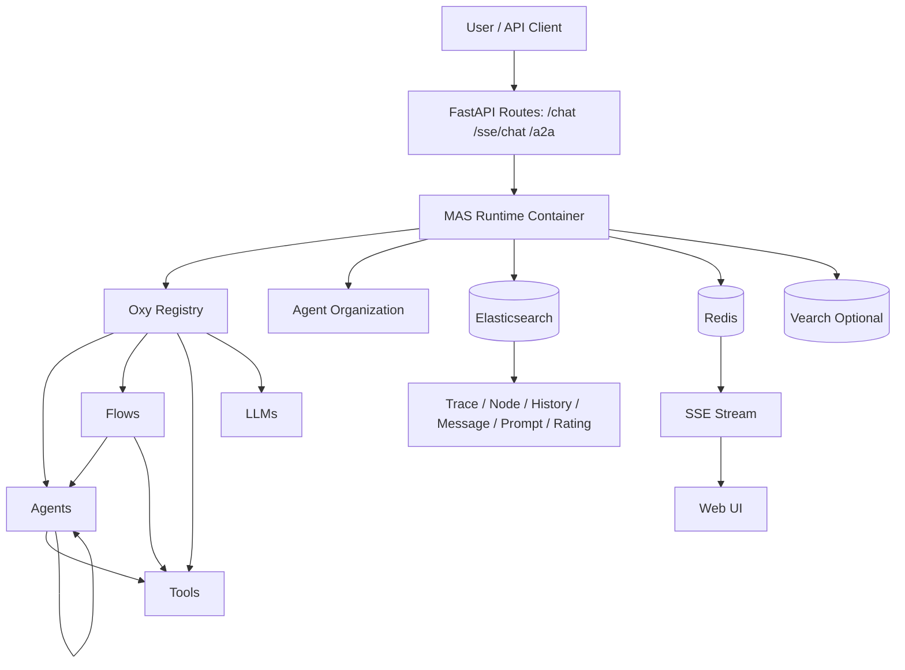
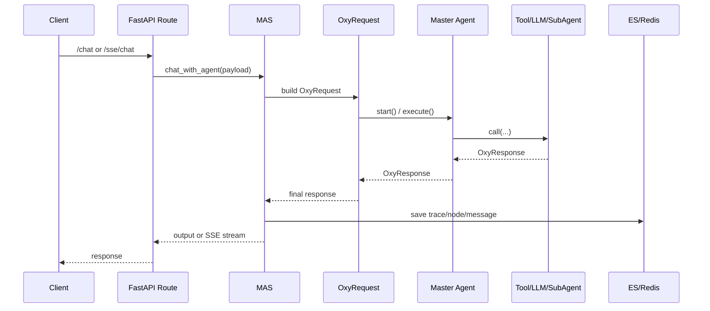

# OxyGent 架构设计与核心理念

## 1. 文档目标

本文面向 OxyGent 使用者与二次开发者，给出一份可以直接用于架构评审的说明：

- OxyGent 的核心设计理念是什么
- 系统如何分层、每层职责如何划分
- 一次请求在系统里如何流转
- 为什么这些设计可以支持多智能体协作、可观测和持续演进

---

## 2. 核心设计理念

### 2.1 一切能力统一为 Oxy（统一抽象）

OxyGent 将 Agent、Tool、LLM、Flow 统一抽象为 `Oxy`，共享同一套执行生命周期与上下文协议。
这使系统具备“同构可组合”特性：上层编排无需关心下层是模型、工具还是远端 Agent。

关键代码：
- `oxygent/oxy/base_oxy.py`
- `oxygent/oxy/base_agent.py`
- `oxygent/oxy/base_tool.py`
- `oxygent/oxy/base_flow.py`

### 2.2 容器化编排（MAS）与业务逻辑解耦

`MAS` 作为运行时容器，负责注册、初始化、路由、组织拓扑、服务暴露与资源治理；
具体业务推理逻辑仍在各个 Oxy 内。

关键代码：
- `oxygent/mas.py`

### 2.3 显式上下文协议（OxyRequest / OxyResponse）

OxyGent 不用隐式全局状态串联链路，而是通过 `OxyRequest` 显式传递：

- 调用链：`caller/callee/call_stack/node_id_stack`
- 会话链：`from_trace_id/current_trace_id/root_trace_ids/group_id`
- 数据域：`arguments/shared_data/group_data/global_data`

关键代码：
- `oxygent/schemas/oxy.py`

### 2.4 可观测优先（全链路留痕 + 流式消息）

系统将节点过程、会话轨迹、历史对话结构化落库（ES），并可按配置存储流式消息，
并通过 Redis + SSE 实时推送前端，形成“可回放、可审计、可调试”的执行闭环。

关键代码：
- `oxygent/mas.py`（`init_db`, `send_message`, `event_stream`）
- `oxygent/routes.py`

### 2.5 安全与治理内建

调用时默认进行权限检查（谁可调用谁），并通过超时、重试、并发信号量控制风险。
`OxyFactory` 对外动态创建组件时内置危险类阻断，降低 RCE 面风险。

关键代码：
- `oxygent/schemas/oxy.py`（`call` 的权限/超时检查）
- `oxygent/oxy/base_oxy.py`（重试、并发、异常处理）
- `oxygent/oxy_factory.py`

### 2.6 开放扩展优先

通过 FunctionHub、MCP、Remote Agent、A2A 适配层，系统可以持续接入新能力，且不破坏主执行模型。

关键代码：
- `oxygent/oxy/function_tools/function_hub.py`
- `oxygent/oxy/mcp_tools/base_mcp_client.py`
- `oxygent/oxy/agents/sse_oxy_agent.py`
- `oxygent/a2a/routes.py`

---

## 3. 总体架构分层

### 3.1 接口层

- 对话入口：`/chat`, `/sse/chat`, `/async/chat`
- 可视化与调试入口：`/view`, `/node`, `/get_organization`
- 协议互通入口：A2A `/.well-known/agent-card.json`, `/v1/message:send`, `/v1/message:stream`

关键代码：
- `oxygent/mas.py`（内嵌服务启动与路由挂载）
- `oxygent/routes.py`
- `oxygent/a2a/routes.py`

### 3.2 运行时编排层（MAS）

核心职责：

- 组件注册与初始化（LLM/Tool 优先，随后 Flow/Agent）
- 主 Agent 识别与组织结构构建
- DB 初始化与索引准备
- 服务启动、SSE 任务管理、后台任务清理

关键代码：
- `oxygent/mas.py`

### 3.3 能力执行层（Oxy 层）

- Agent：`ChatAgent`, `ReActAgent`, `WorkflowAgent`, `ParallelAgent`, `PlanAndSolveAgent`, `RAGAgent`
- Flow：`Workflow`, `ParallelFlow`, `PlanAndSolve`, `Reflexion`
- Tool：`FunctionTool`, `MCPTool`, `HttpTool`, BankTool
- LLM：`HttpLLM`, `OpenAILLM`, `LocalLLM`

统一行为基于 `Oxy.execute()` 生命周期。

### 3.4 基础设施层

- Elasticsearch：trace/node/history/prompt/rating 等索引（`message` 为可选）
- Redis：SSE 队列缓冲与异步消息分发
- Vearch（可选）：工具检索与向量能力

---

## 4. 关键执行链路

### 4.1 请求主链路（从用户到最终输出）

### 4.2 Oxy 生命周期（统一执行协议）

在 `Oxy.execute()` 中，统一执行顺序为：

1. `_pre_process`
2. `_pre_log`
3. `_request_interceptor`
4. `_pre_save_data`
5. `_format_input`
6. `_pre_send_message`
7. `_before_execute`
8. `_execute`（含重试）
9. `_after_execute`
10. `_post_process`
11. `_post_log`
12. `_post_save_data`
13. `_format_output`
14. `_post_send_message`

该链路是 OxyGent “稳定、可追踪、可扩展”的核心基础。

---

## 5. 上下文与数据域设计

OxyGent 通过多层数据域避免上下文污染，同时支持跨节点传递：

- `arguments`：当前节点私有输入
- `shared_data`：同一请求链路共享数据
- `group_data`：同会话组共享数据（跨 trace）
- `mas.global_data`：应用级全局共享数据

配合 `trace_id/group_id/request_id`，可以实现：

- 完整会话追踪
- 断点重跑与引用执行（`restart_node_id`, `reference_trace_id`）
- 线上问题快速定位

---

## 6. 多智能体协作范式

OxyGent 不是单一范式框架，而是多范式并存：

- `ChatAgent`：标准对话
- `ReActAgent`：推理-行动循环（可工具调用、可并行工具调用）
- `ParallelAgent`：并行执行多个子能力并归纳
- `WorkflowAgent` / `Workflow`：显式过程编排（开发者完全可控）
- `PlanAndSolve`：规划-执行-再规划
- `Reflexion`：执行-评估-改进闭环
- `RAGAgent`：检索知识注入 Prompt

设计本质：
OxyGent 把“策略”（Agent/Flow）与“能力单元”（Tool/LLM）解耦，再由 MAS 运行时动态拼装。

---

## 7. 扩展机制设计

### 7.1 本地函数扩展

- `FunctionHub` 通过装饰器将 Python 函数批量注册为工具
- `FunctionTool` 自动从函数签名提取输入 schema

### 7.2 MCP 协议扩展

- `BaseMCPClient` 连接 MCP Server，动态发现工具并注册 `MCPTool`
- Agent 无需改动即可消费外部工具生态

### 7.3 分布式与跨系统互通

- `SSEOxyGent` 将远端 OxyGent 实例作为本地可调用 Agent
- A2A 路由将 OxyGent 对外暴露为标准 Agent2Agent 服务

---

## 8. 可观测与演进闭环

### 8.1 可观测

MAS 初始化时创建关键索引（按 app 名隔离）：

- `{app}_trace`
- `{app}_node`
- `{app}_history`
- `{app}_message`（可选，需开启 `message.is_stored`）
- `{app}_prompt`
- `{app}_prompt_history`
- `{app}_rating`
- `{app}_rating_stats`

这保证了对话、节点、流式消息、Prompt 版本、用户反馈都可追踪。

### 8.2 演进

通过节点与历史数据可直接构建训练数据（如 SFT 样本），并结合反馈统计形成持续优化闭环。

参考：
- `docs/docs_zh/13_training.md`
- `oxygent/evaluation_manager.py`

---

## 9. 架构取舍与边界

### 9.1 优势

- 强一致的抽象与执行协议，组件互换成本低
- 可观测性从架构层内建，而非事后补丁
- 支持从单机到分布式再到协议互通的平滑扩展

### 9.2 取舍

- 全链路落库会引入存储与写放大成本（可通过配置关闭部分消息存储）
- 多层 Hook 与配置虽然灵活，但对新手有学习曲线
- 高并发场景需合理配置 `semaphore/timeout/retries` 与外部依赖容量

---

## 10. 一句话总结

OxyGent 的核心不是“某一种 Agent 算法”，而是：
**用统一 Oxy 执行协议 + MAS 容器编排 + 全链路可观测，把多智能体系统工程化、可维护化、可演进化。**
