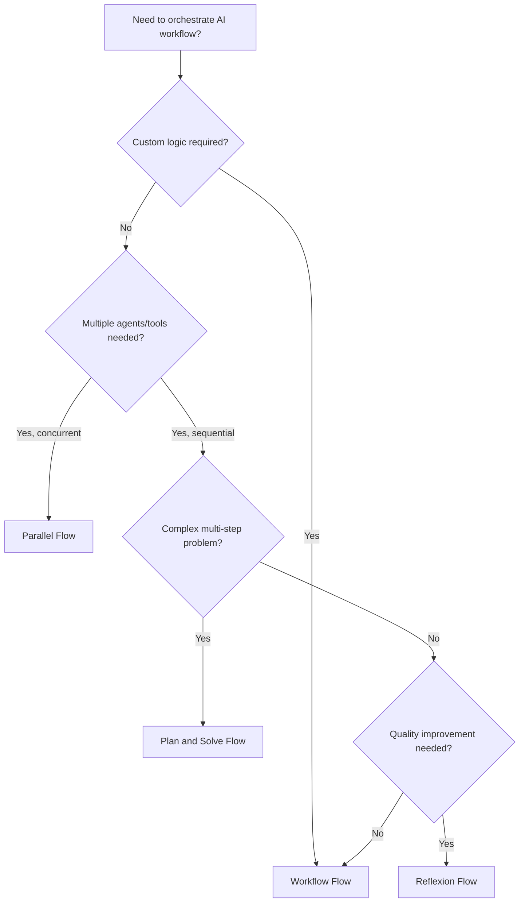

# OxyGent Flows

The OxyGent flows system provides powerful abstractions for orchestrating complex AI workflows, enabling sophisticated patterns like parallel execution, iterative refinement, strategic planning, and custom workflow logic.

## Overview

Flows in OxyGent are specialized classes that extend the BaseFlow framework to implement specific workflow patterns. Each flow type addresses different use cases and computational patterns, allowing you to build sophisticated AI applications with minimal boilerplate code.

### Core Concepts

**Flow Architecture**: All flows inherit from `BaseFlow`, which extends the base `Oxy` class with workflow-specific capabilities including:
- Permission management for tool access
- Request/response orchestration
- State management and error handling
- Integration with the OxyGent framework

**Request Distribution**: Flows can coordinate multiple agents, tools, and services by distributing requests, aggregating responses, and applying custom logic to achieve complex behaviors.

**Asynchronous Execution**: All flows support asynchronous operations, enabling high-performance concurrent processing and non-blocking I/O operations.

## Available Flow Types

### Workflow Flow
**Purpose**: Execute custom workflow functions within the OxyGent framework
**Best For**: Custom business logic, domain-specific processing, API integrations

```python
from oxygent.oxy.flows import Workflow

async def custom_processor(oxy_request: OxyRequest):
    # Your custom logic here
    return {"processed": True}

workflow = Workflow(
    name="custom_flow",
    func_workflow=custom_processor
)
```

**Key Features**:
- Bridge between OxyGent framework and custom code
- Flexible function-based approach
- Support for arbitrary processing logic
- Easy integration with external systems

[→ Learn more about Workflow Flow](/workflow-flow)

### Parallel Flow
**Purpose**: Execute multiple tools or agents concurrently with the same request
**Best For**: Consensus building, load distribution, multi-perspective analysis

```python
from oxygent.oxy.flows import ParallelFlow

parallel_flow = ParallelFlow(
    name="consensus_builder",
    permitted_tool_name_list=[
        "agent_1", "agent_2", "agent_3"
    ]
)
```

**Key Features**:
- Concurrent execution across multiple tools
- Automatic response aggregation  
- Performance optimization through parallelization
- Ideal for A/B testing and consensus building

[→ Learn more about Parallel Flow](/parallel-flow)

### Plan and Solve Flow
**Purpose**: Break down complex problems into sequential steps with strategic planning
**Best For**: Multi-step problems, project management, systematic problem solving

```python
from oxygent.oxy.flows import PlanAndSolve

plan_solve = PlanAndSolve(
    name="strategic_solver",
    planner_agent_name="planner",
    executor_agent_name="executor",
    enable_replanner=True
)
```

**Key Features**:
- Intelligent problem decomposition
- Step-by-step execution with progress tracking
- Optional dynamic re-planning based on results
- Structured approach to complex problem solving

[→ Learn more about Plan and Solve Flow](/plan-and-solve-flow)

### Reflexion Flow
**Purpose**: Iterative improvement through self-evaluation and refinement
**Best For**: Quality assurance, content optimization, iterative enhancement

```python
from oxygent.oxy.flows import Reflexion, MathReflexion

# General reflexion
reflexion = Reflexion(
    name="quality_improver",
    worker_agent="generator",
    reflexion_agent="evaluator"
)

# Specialized math reflexion
math_reflexion = MathReflexion(
    name="math_solver",
    max_reflexion_rounds=5
)
```

**Key Features**:
- Self-evaluation and improvement cycles
- Quality-driven iteration until satisfaction criteria met
- Specialized variants for domain-specific needs
- Built-in evaluation templates and parsing

[→ Learn more about Reflexion Flow](/reflexion-flow)

## Flow Selection Guide

### When to Use Each Flow Type

| Flow Type | Use Cases | Key Benefits | Complexity |
|-----------|-----------|--------------|------------|
| **Workflow** | Custom logic, API integration, business rules | Maximum flexibility, easy integration | Low |
| **Parallel** | Consensus building, load balancing, comparison | Speed through concurrency, multiple perspectives | Low-Medium |
| **PlanAndSolve** | Multi-step problems, project planning, systematic tasks | Structured approach, adaptive planning | Medium-High |
| **Reflexion** | Quality improvement, content optimization, verification | Iterative enhancement, built-in quality control | Medium-High |

### Decision Framework



## Common Usage Patterns

### Flow Composition

Combine multiple flows for sophisticated workflows:

```python
from oxygent.oxy.flows import Workflow, ParallelFlow, Reflexion

async def hybrid_workflow(oxy_request: OxyRequest):
    """Combine multiple flow patterns."""
    
    # Step 1: Parallel initial processing
    parallel_flow = ParallelFlow(
        permitted_tool_name_list=["analyzer_1", "analyzer_2"]
    )
    initial_results = await parallel_flow._execute(oxy_request)
    
    # Step 2: Reflexion for quality improvement
    reflexion_flow = Reflexion(
        worker_agent="synthesizer",
        reflexion_agent="quality_checker"
    )
    
    synthesis_request = OxyRequest(
        callee="synthesizer",
        arguments={"query": f"Synthesize: {initial_results.output}"}
    )
    
    final_result = await reflexion_flow._execute(synthesis_request)
    
    return {
        "initial_analysis": initial_results.output,
        "final_synthesis": final_result.output,
        "processing_metadata": {
            "parallel_agents": len(parallel_flow.permitted_tool_name_list),
            "reflexion_rounds": final_result.extra.get("reflexion_rounds", 0)
        }
    }

# Create composite workflow
composite_flow = Workflow(
    name="advanced_processor",
    desc="Multi-stage processing with parallel analysis and quality refinement",
    func_workflow=hybrid_workflow
)
```

### Conditional Flow Selection

Dynamically choose flows based on request characteristics:

```python
async def adaptive_workflow(oxy_request: OxyRequest):
    """Adaptively select flow based on request."""
    
    query = oxy_request.get_query()
    complexity_score = analyze_complexity(query)
    
    if complexity_score > 8:
        # High complexity: use plan-and-solve
        flow = PlanAndSolve(
            planner_agent_name="expert_planner",
            executor_agent_name="specialist_executor",
            enable_replanner=True
        )
    elif "compare" in query.lower() or "multiple" in query.lower():
        # Comparison needed: use parallel flow
        flow = ParallelFlow(
            permitted_tool_name_list=["option_1", "option_2", "option_3"]
        )
    elif requires_quality_assurance(query):
        # Quality critical: use reflexion
        flow = Reflexion(
            worker_agent="expert_generator",
            reflexion_agent="quality_auditor",
            max_reflexion_rounds=5
        )
    else:
        # Simple processing: direct execution
        return await simple_processing(oxy_request)
    
    return await flow._execute(oxy_request)

def analyze_complexity(query: str) -> int:
    """Analyze query complexity (1-10 scale)."""
    complexity_indicators = [
        "step-by-step", "analyze", "compare", "evaluate", 
        "implement", "design", "optimize", "solve"
    ]
    
    base_score = len(query.split()) / 10  # Length-based score
    keyword_bonus = sum(1 for keyword in complexity_indicators if keyword in query.lower())
    
    return min(10, base_score + keyword_bonus)

def requires_quality_assurance(query: str) -> bool:
    """Determine if query requires quality assurance."""
    quality_keywords = [
        "accurate", "precise", "correct", "verify", "review", 
        "high-quality", "professional", "detailed"
    ]
    return any(keyword in query.lower() for keyword in quality_keywords)
```

### Flow Monitoring and Analytics

Track flow performance and behavior:

```python
class MonitoredFlow:
    """Base class for flow monitoring."""
    
    def __init__(self, flow_instance):
        self.flow = flow_instance
        self.metrics = {
            "execution_count": 0,
            "total_duration": 0,
            "success_rate": 0,
            "average_duration": 0
        }
    
    async def execute_with_monitoring(self, oxy_request: OxyRequest):
        """Execute flow with monitoring."""
        
        start_time = time.time()
        self.metrics["execution_count"] += 1
        
        try:
            result = await self.flow._execute(oxy_request)
            
            # Track success
            duration = time.time() - start_time
            self.metrics["total_duration"] += duration
            self.metrics["average_duration"] = (
                self.metrics["total_duration"] / self.metrics["execution_count"]
            )
            
            if result.state == OxyState.COMPLETED:
                success_count = self.metrics.get("success_count", 0) + 1
                self.metrics["success_count"] = success_count
                self.metrics["success_rate"] = (
                    success_count / self.metrics["execution_count"]
                )
            
            # Enhance result with metrics
            result.extra = result.extra or {}
            result.extra["execution_metrics"] = self.metrics.copy()
            
            return result
            
        except Exception as e:
            logger.error(f"Flow execution failed: {str(e)}")
            
            return OxyResponse(
                state=OxyState.FAILED,
                output=f"Flow execution failed: {str(e)}",
                extra={"execution_metrics": self.metrics.copy()}
            )

# Usage
monitored_reflexion = MonitoredFlow(
    Reflexion(
        name="quality_improver",
        worker_agent="content_generator",
        reflexion_agent="quality_evaluator"
    )
)

result = await monitored_reflexion.execute_with_monitoring(request)
print(f"Success rate: {result.extra['execution_metrics']['success_rate']:.2%}")
```

## Integration with OxyGent Framework

### OxySpace Configuration

Configure flows in your OxyGent space:

```python
def create_flow_ecosystem():
    """Create a comprehensive flow ecosystem."""
    
    return [
        # Basic workflow flows
        Workflow(
            name="data_processor",
            desc="Custom data processing workflow",
            func_workflow=data_processing_workflow
        ),
        
        # Parallel processing flows
        ParallelFlow(
            name="multi_model_consensus",
            desc="Get consensus from multiple AI models",
            permitted_tool_name_list=["gpt4", "claude", "gemini"]
        ),
        
        # Strategic problem solving
        PlanAndSolve(
            name="project_planner",
            desc="Strategic project planning and execution",
            planner_agent_name="strategic_planner",
            executor_agent_name="project_executor",
            enable_replanner=True,
            max_replan_rounds=20
        ),
        
        # Quality assurance flows
        Reflexion(
            name="content_optimizer",
            desc="Content quality optimization through reflexion",
            worker_agent="content_writer",
            reflexion_agent="content_critic",
            max_reflexion_rounds=4
        ),
        
        # Specialized mathematical processing
        MathReflexion(
            name="math_problem_solver",
            desc="Mathematical problem solving with verification",
            max_reflexion_rounds=6
        ),
        
        # Domain-specific flows
        create_research_flow(),
        create_software_development_flow(),
        create_content_creation_flow()
    ]

def create_research_flow():
    """Create specialized research workflow."""
    return PlanAndSolve(
        name="research_workflow",
        desc="Academic research planning and execution",
        planner_agent_name="research_planner",
        executor_agent_name="research_executor",
        enable_replanner=True,
        max_replan_rounds=15
    )

def create_software_development_flow():
    """Create software development workflow."""
    return PlanAndSolve(
        name="dev_workflow", 
        desc="Software development lifecycle management",
        planner_agent_name="architect_agent",
        executor_agent_name="developer_agent",
        enable_replanner=True,
        max_replan_rounds=25
    )

def create_content_creation_flow():
    """Create content creation workflow."""
    return Reflexion(
        name="premium_content_creator",
        desc="High-quality content creation with editorial review",
        worker_agent="senior_writer",
        reflexion_agent="editorial_reviewer",
        max_reflexion_rounds=5,
        evaluation_template=get_editorial_evaluation_template()
    )

def get_editorial_evaluation_template():
    """Get editorial evaluation template."""
    return """
    Editorial Review Checklist:
    
    Content: {query}
    Draft: {answer}
    
    Evaluation Criteria:
    1. Accuracy: Are all facts correct and well-sourced?
    2. Clarity: Is the writing clear and easy to understand?
    3. Engagement: Is the content engaging and compelling?
    4. Structure: Is the content well-organized?
    5. Style: Is the writing style appropriate for the audience?
    6. Completeness: Does it fully address the topic?
    
    Editorial Decision:
    - is_satisfactory: true/false
    - evaluation_reason: [Editorial assessment]
    - improvement_suggestions: [Specific editorial guidance]
    """
```

### Request Execution Examples

```python
# Execute different flow types
async def demonstrate_flows():
    """Demonstrate different flow execution patterns."""
    
    # Workflow execution
    workflow_request = OxyRequest(
        callee="data_processor",
        arguments={
            "data": [1, 2, 3, 4, 5],
            "operation": "statistical_analysis"
        }
    )
    workflow_result = await workflow_request.call()
    
    # Parallel execution
    parallel_request = OxyRequest(
        callee="multi_model_consensus",
        arguments={
            "query": "What are the key factors driving climate change?"
        }
    )
    parallel_result = await parallel_request.call()
    
    # Plan and solve execution
    planning_request = OxyRequest(
        callee="project_planner",
        arguments={
            "query": "Plan and implement a customer feedback system"
        }
    )
    planning_result = await planning_request.call()
    
    # Reflexion execution
    quality_request = OxyRequest(
        callee="content_optimizer",
        arguments={
            "query": "Write a comprehensive guide to machine learning"
        }
    )
    quality_result = await quality_request.call()
    
    return {
        "workflow": workflow_result,
        "parallel": parallel_result, 
        "planning": planning_result,
        "reflexion": quality_result
    }
```

## Best Practices

### 1. Flow Selection Strategy

```python
# Choose flows based on problem characteristics
def select_optimal_flow(problem_description: str) -> str:
    """Select the most appropriate flow for a given problem."""
    
    problem_lower = problem_description.lower()
    
    # Multi-step complex problems
    if any(word in problem_lower for word in ["plan", "implement", "design", "develop", "create system"]):
        return "plan_and_solve_flow"
    
    # Quality-critical tasks
    if any(word in problem_lower for word in ["accurate", "precise", "high-quality", "review"]):
        return "reflexion_flow"
    
    # Comparison or consensus tasks
    if any(word in problem_lower for word in ["compare", "consensus", "multiple options", "different approaches"]):
        return "parallel_flow"
    
    # Custom or domain-specific logic
    return "workflow_flow"
```

### 2. Error Handling and Resilience

```python
class ResilientFlowManager:
    """Manage flows with comprehensive error handling."""
    
    def __init__(self, flows: Dict[str, BaseFlow]):
        self.flows = flows
        self.fallback_flow = "workflow_flow"  # Default fallback
    
    async def execute_with_fallback(
        self, 
        flow_name: str, 
        oxy_request: OxyRequest
    ) -> OxyResponse:
        """Execute flow with fallback strategy."""
        
        try:
            # Primary flow execution
            primary_flow = self.flows.get(flow_name)
            if not primary_flow:
                raise ValueError(f"Flow not found: {flow_name}")
            
            return await primary_flow._execute(oxy_request)
            
        except Exception as primary_error:
            logger.warning(f"Primary flow {flow_name} failed: {str(primary_error)}")
            
            try:
                # Fallback to simpler flow
                fallback_flow = self.flows.get(self.fallback_flow)
                if fallback_flow and fallback_flow != primary_flow:
                    logger.info(f"Using fallback flow: {self.fallback_flow}")
                    return await fallback_flow._execute(oxy_request)
                    
            except Exception as fallback_error:
                logger.error(f"Fallback flow also failed: {str(fallback_error)}")
            
            # Ultimate fallback
            return OxyResponse(
                state=OxyState.FAILED,
                output=f"All flows failed. Primary error: {str(primary_error)}",
                extra={
                    "primary_error": str(primary_error),
                    "attempted_fallback": True
                }
            )
```

### 3. Performance Optimization

```python
# Optimize flows for specific use cases
class OptimizedFlowFactory:
    """Factory for creating optimized flow configurations."""
    
    @staticmethod
    def create_high_throughput_parallel(tool_names: List[str]) -> ParallelFlow:
        """Create parallel flow optimized for high throughput."""
        
        return ParallelFlow(
            name="high_throughput_parallel",
            desc="High-throughput parallel processing",
            permitted_tool_name_list=tool_names,
            # Add performance-specific configurations
        )
    
    @staticmethod
    def create_quality_focused_reflexion(
        worker_agent: str,
        evaluator_agent: str
    ) -> Reflexion:
        """Create reflexion flow optimized for quality."""
        
        return Reflexion(
            name="quality_focused_reflexion",
            desc="Quality-focused iterative improvement", 
            worker_agent=worker_agent,
            reflexion_agent=evaluator_agent,
            max_reflexion_rounds=6,  # More rounds for higher quality
            evaluation_template=get_comprehensive_evaluation_template()
        )
    
    @staticmethod
    def create_rapid_planning_flow(
        planner: str,
        executor: str
    ) -> PlanAndSolve:
        """Create planning flow optimized for speed."""
        
        return PlanAndSolve(
            name="rapid_planner",
            desc="Rapid planning and execution",
            planner_agent_name=planner,
            executor_agent_name=executor,
            max_replan_rounds=10,  # Fewer rounds for speed
            enable_replanner=False  # Disable re-planning for speed
        )
```

### 4. Monitoring and Observability

```python
import logging
from typing import Dict, Any

class FlowAnalytics:
    """Comprehensive flow analytics and monitoring."""
    
    def __init__(self):
        self.execution_history = []
        self.performance_metrics = {}
    
    def log_execution(
        self,
        flow_name: str,
        request: OxyRequest,
        response: OxyResponse,
        duration: float
    ):
        """Log flow execution for analytics."""
        
        execution_record = {
            "timestamp": time.time(),
            "flow_name": flow_name,
            "query_length": len(request.get_query()),
            "response_state": response.state.value,
            "response_length": len(response.output) if response.output else 0,
            "duration": duration,
            "extra_data": response.extra or {}
        }
        
        self.execution_history.append(execution_record)
        self._update_metrics(flow_name, execution_record)
    
    def _update_metrics(self, flow_name: str, record: Dict[str, Any]):
        """Update performance metrics."""
        
        if flow_name not in self.performance_metrics:
            self.performance_metrics[flow_name] = {
                "total_executions": 0,
                "total_duration": 0,
                "success_count": 0,
                "average_duration": 0,
                "success_rate": 0
            }
        
        metrics = self.performance_metrics[flow_name]
        metrics["total_executions"] += 1
        metrics["total_duration"] += record["duration"]
        
        if record["response_state"] == "completed":
            metrics["success_count"] += 1
        
        metrics["average_duration"] = metrics["total_duration"] / metrics["total_executions"]
        metrics["success_rate"] = metrics["success_count"] / metrics["total_executions"]
    
    def get_flow_performance(self, flow_name: str) -> Dict[str, Any]:
        """Get performance metrics for a specific flow."""
        return self.performance_metrics.get(flow_name, {})
    
    def get_top_performing_flows(self, limit: int = 5) -> List[Dict[str, Any]]:
        """Get top performing flows by success rate."""
        
        flow_performance = [
            {"flow_name": name, **metrics}
            for name, metrics in self.performance_metrics.items()
        ]
        
        return sorted(
            flow_performance,
            key=lambda x: x["success_rate"],
            reverse=True
        )[:limit]
```

## Advanced Topics

### Custom Flow Development

Create your own specialized flows:

```python
class CustomDomainFlow(BaseFlow):
    """Custom flow for domain-specific processing."""
    
    def __init__(self, domain_config: Dict[str, Any], **kwargs):
        super().__init__(**kwargs)
        self.domain_config = domain_config
        
        # Configure domain-specific tools
        self.add_permitted_tools(domain_config.get("required_tools", []))
    
    async def _execute(self, oxy_request: OxyRequest) -> OxyResponse:
        """Execute domain-specific processing logic."""
        
        # Pre-processing based on domain
        processed_query = self._preprocess_query(oxy_request.get_query())
        
        # Execute domain-specific workflow
        result = await self._domain_specific_processing(
            processed_query, 
            oxy_request.arguments
        )
        
        # Post-processing
        final_output = self._postprocess_result(result)
        
        return OxyResponse(
            state=OxyState.COMPLETED,
            output=final_output,
            extra={
                "domain": self.domain_config.get("domain_name"),
                "processing_steps": ["preprocess", "execute", "postprocess"]
            }
        )
    
    def _preprocess_query(self, query: str) -> str:
        """Apply domain-specific query preprocessing."""
        # Implementation specific to your domain
        return query
    
    async def _domain_specific_processing(
        self, 
        query: str, 
        arguments: Dict[str, Any]
    ) -> Any:
        """Execute domain-specific processing logic."""
        # Implementation specific to your domain
        return {"processed": True}
    
    def _postprocess_result(self, result: Any) -> str:
        """Apply domain-specific result post-processing."""
        # Implementation specific to your domain
        return str(result)
```

### Flow Composition Patterns

Advanced composition techniques:

```python
class FlowOrchestrator:
    """Advanced flow composition and orchestration."""
    
    def __init__(self, flows: Dict[str, BaseFlow]):
        self.flows = flows
    
    async def execute_sequential_flows(
        self, 
        flow_sequence: List[str],
        initial_request: OxyRequest
    ) -> List[OxyResponse]:
        """Execute flows in sequence, passing results between them."""
        
        results = []
        current_input = initial_request.get_query()
        
        for flow_name in flow_sequence:
            flow = self.flows[flow_name]
            
            # Create request for current flow
            current_request = OxyRequest(
                callee=flow_name,
                arguments={"query": current_input}
            )
            
            # Execute flow
            result = await flow._execute(current_request)
            results.append(result)
            
            # Use output as input for next flow
            current_input = result.output
        
        return results
    
    async def execute_conditional_flows(
        self,
        condition_evaluator: Callable[[str], str],
        flow_map: Dict[str, str],
        request: OxyRequest
    ) -> OxyResponse:
        """Execute flows based on conditional logic."""
        
        # Evaluate condition
        condition = condition_evaluator(request.get_query())
        
        # Select appropriate flow
        selected_flow_name = flow_map.get(condition, "default_flow")
        selected_flow = self.flows[selected_flow_name]
        
        # Execute selected flow
        result = await selected_flow._execute(request)
        
        # Add condition information
        result.extra = result.extra or {}
        result.extra.update({
            "condition_evaluated": condition,
            "selected_flow": selected_flow_name,
            "available_conditions": list(flow_map.keys())
        })
        
        return result
```

## Troubleshooting

### Common Issues and Solutions

**Issue**: Flow execution timeout
**Solution**: Implement timeout handling and optimize agent response times

```python
import asyncio

async def execute_with_timeout(flow: BaseFlow, request: OxyRequest, timeout: float = 60.0):
    """Execute flow with timeout protection."""
    try:
        return await asyncio.wait_for(
            flow._execute(request),
            timeout=timeout
        )
    except asyncio.TimeoutError:
        return OxyResponse(
            state=OxyState.FAILED,
            output=f"Flow execution timed out after {timeout} seconds"
        )
```

**Issue**: Memory consumption with complex flows
**Solution**: Implement result caching and cleanup strategies

```python
class MemoryEfficientFlow(BaseFlow):
    """Base class for memory-efficient flow operations."""
    
    def __init__(self, max_cache_size: int = 100, **kwargs):
        super().__init__(**kwargs)
        self.result_cache = {}
        self.max_cache_size = max_cache_size
    
    async def _execute(self, oxy_request: OxyRequest) -> OxyResponse:
        """Execute with memory management."""
        
        # Clean cache if too large
        if len(self.result_cache) > self.max_cache_size:
            self._cleanup_cache()
        
        # Execute with caching
        result = await super()._execute(oxy_request)
        
        # Cache result
        cache_key = hash(oxy_request.get_query())
        self.result_cache[cache_key] = result
        
        return result
    
    def _cleanup_cache(self):
        """Clean up old cache entries."""
        # Keep only the most recent entries
        sorted_items = sorted(
            self.result_cache.items(),
            key=lambda x: getattr(x[1], 'timestamp', 0)
        )
        
        self.result_cache = dict(sorted_items[-self.max_cache_size // 2:])
```

## Related Documentation

- [BaseFlow](/base-flow) - Foundation class for all flows
- [Workflow Flow](/workflow-flow) - Custom workflow execution
- [Parallel Flow](/parallel-flow) - Concurrent execution patterns
- [Plan and Solve Flow](/plan-and-solve-flow) - Strategic planning workflows
- [Reflexion Flow](/reflexion-flow) - Iterative improvement flows
- [OxyGent Agents](/index) - Agent system overview
- [OxyRequest](/oxy-request) - Request object structure
- [OxyResponse](/oxy-response) - Response object structure

## Getting Started

1. **Choose Your Flow Type**: Use the decision framework above to select the appropriate flow
2. **Configure Agents and Tools**: Set up the required agents and permitted tools
3. **Customize Templates**: Adapt evaluation and improvement templates for your use case
4. **Test and Iterate**: Start with simple configurations and gradually add complexity
5. **Monitor Performance**: Use the analytics patterns to track and optimize flow performance

The OxyGent flows system provides a powerful foundation for building sophisticated AI applications. Start with the basic patterns and gradually incorporate advanced techniques as your requirements grow.