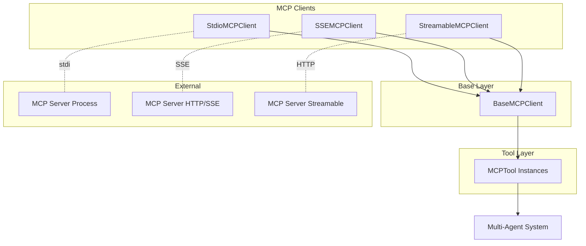

# MCP Tools Overview

The MCP (Model Context Protocol) Tools system provides seamless integration with external MCP servers, enabling OxyGent to leverage a wide ecosystem of external tools and services. This system supports multiple transport protocols and provides automatic tool discovery and lifecycle management.

## Architecture Overview

The MCP Tools system is built around a modular architecture supporting multiple communication protocols:



## Core Components

### [BaseMCPClient](./base-mcp-client)
Abstract base class providing core MCP functionality including:
- Server lifecycle management
- Tool discovery and registration
- Execution delegation
- Resource cleanup

### Transport Implementations

#### [StdioMCPClient](./stdio-mcp-client)
- **Protocol**: Standard Input/Output
- **Use Case**: Local processes, Node.js servers
- **Features**: Process spawning, directory validation
- **Best For**: Development, local integrations

#### [SSEMCPClient](./sse-mcp-client)  
- **Protocol**: Server-Sent Events
- **Use Case**: Real-time streaming, live updates
- **Features**: Unidirectional streaming, middleware support
- **Best For**: Real-time data, streaming responses

#### [StreamableMCPClient](./streamable-mcp-client)
- **Protocol**: Streamable HTTP
- **Use Case**: HTTP-based streaming
- **Features**: HTTP transport with streaming capabilities
- **Best For**: Web services, HTTP APIs

### [MCPTool](./mcp-tool)
Individual tool proxy that represents external MCP server tools within the OxyGent system.

## Quick Start

### Basic MCP Server Integration

```python
from oxygent.oxy.mcp_tools import StdioMCPClient

# Configure MCP server connection
mcp_client = StdioMCPClient(
    name="filesystem_server",
    desc="Local filesystem operations",
    params={
        "command": "npx",
        "args": ["-y", "@modelcontextprotocol/server-filesystem", "/tmp/mcp-workspace"],
        "env": {}
    }
)

# Initialize and discover tools
await mcp_client.init()
# This discovers all tools from the MCP server and registers them with MAS
```

### SSE-Based Integration

```python
from oxygent.oxy.mcp_tools import SSEMCPClient

# Connect to SSE-enabled MCP server
sse_client = SSEMCPClient(
    name="data_stream_server",
    desc="Real-time data streaming",
    sse_url="https://mcp-server.example.com/sse",
    headers={"Authorization": "Bearer token123"}
)

await sse_client.init()
```

### Integration with Agents

```python
from oxygent.agents import ChatAgent

# Create agent with MCP tools
agent = ChatAgent(name="mcp_agent")
agent.add_oxy(mcp_client)

# MCP tools are now available to the agent
response = await agent.execute(OxyRequest(
    callee="read_file",  # Tool discovered from MCP server
    arguments={"path": "/tmp/example.txt"}
))
```

## Supported MCP Features

### Protocol Compliance
- ✅ **MCP Protocol v1.0**: Full compliance with latest standard
- ✅ **Tool Discovery**: Automatic `list_tools` integration
- ✅ **Tool Execution**: `call_tool` with argument mapping
- ✅ **Error Handling**: Comprehensive error propagation
- ✅ **Resource Management**: Proper connection lifecycle

### Transport Protocols
- ✅ **Standard I/O**: Process-based communication
- ✅ **Server-Sent Events**: Real-time streaming
- ✅ **Streamable HTTP**: HTTP-based streaming
- 🔄 **WebSocket**: Planned for future releases

### Advanced Features
- ✅ **Keep-Alive Connections**: Persistent connections for performance
- ✅ **Middleware Support**: Custom middleware for SSE/HTTP clients
- ✅ **Automatic Reconnection**: Connection recovery for SSE clients
- ✅ **Environment Variables**: Full environment control for stdio clients
- ✅ **Custom Headers**: HTTP header customization

## Configuration Patterns

### Stdio Configuration

```python
# Local Node.js MCP server
stdio_config = {
    "command": "node",
    "args": ["server.js"],
    "env": {
        "NODE_ENV": "production",
        "MCP_LOG_LEVEL": "info"
    }
}

# NPX-based server with directory validation
npx_config = {
    "command": "npx",
    "args": ["-y", "@modelcontextprotocol/server-filesystem", "/workspace"],
    "env": {}
}

client = StdioMCPClient(
    name="local_server",
    params=stdio_config,
    is_keep_alive=True  # Maintain persistent connection
)
```

### SSE Configuration

```python
# Production SSE server with authentication
sse_config = {
    "sse_url": "https://api.example.com/mcp/sse",
    "headers": {
        "Authorization": "Bearer your-api-token",
        "User-Agent": "OxyGent/1.0",
        "Accept": "text/event-stream"
    },
    "middlewares": [
        AuthenticationMiddleware(),
        LoggingMiddleware()
    ]
}

client = SSEMCPClient(name="production_sse", **sse_config)
```

### Streamable HTTP Configuration

```python
# HTTP streaming server
http_config = {
    "server_url": "https://mcp-server.example.com/stream",
    "headers": {"Content-Type": "application/json"},
    "middlewares": [RequestLoggingMiddleware()]
}

client = StreamableMCPClient(name="http_stream", **http_config)
```

## Integration Examples

### Multi-Server Setup

```python
from oxygent.mas import MAS

# Initialize MAS
mas = MAS()

# File operations server
file_server = StdioMCPClient(
    name="file_ops",
    desc="File system operations",
    params={
        "command": "npx",
        "args": ["-y", "@modelcontextprotocol/server-filesystem", "/workspace"]
    }
)

# Database operations server
db_server = SSEMCPClient(
    name="database_ops", 
    desc="Database operations",
    sse_url="https://db-mcp.example.com/sse"
)

# Web scraping server
web_server = StreamableMCPClient(
    name="web_scraper",
    desc="Web scraping tools",
    server_url="https://scraper-mcp.example.com/stream"
)

# Register all servers
for server in [file_server, db_server, web_server]:
    server.set_mas(mas)
    await server.init()

# All tools from all servers are now available in MAS
```

### Workflow Integration

```python
from oxygent.flows import WorkflowFlow

# Create workflow with MCP tools
workflow = WorkflowFlow(name="data_pipeline")

# Add MCP clients
workflow.add_oxy(file_server)
workflow.add_oxy(db_server)

# Define workflow steps using MCP tools
workflow_config = {
    "steps": [
        {
            "name": "read_data",
            "tool": "read_file",
            "arguments": {"path": "/data/input.json"}
        },
        {
            "name": "process_data", 
            "tool": "query_database",
            "arguments": {"query": "SELECT * FROM users", "data": "{read_data.output}"}
        },
        {
            "name": "save_results",
            "tool": "write_file", 
            "arguments": {"path": "/data/output.json", "content": "{process_data.output}"}
        }
    ]
}
```

### Agent Specialization

```python
# Specialized agents for different MCP servers
file_agent = ChatAgent(name="file_specialist")
file_agent.add_oxy(file_server)

db_agent = ChatAgent(name="database_specialist") 
db_agent.add_oxy(db_server)

# Multi-server agent
general_agent = ChatAgent(name="general_assistant")
general_agent.add_oxy(file_server)
general_agent.add_oxy(db_server)
general_agent.add_oxy(web_server)
```

## Performance Optimization

### Connection Management

```python
# Keep-alive for frequently used servers
frequent_server = StdioMCPClient(
    name="frequent_tools",
    is_keep_alive=True,  # Maintain persistent connection
    params=server_params
)

# One-shot for occasionally used servers
occasional_server = StdioMCPClient(
    name="occasional_tools", 
    is_keep_alive=False,  # Create connection per request
    params=server_params
)
```

### Resource Monitoring

```python
import logging

# Configure detailed logging for performance monitoring
logging.getLogger("oxygent.oxy.mcp_tools").setLevel(logging.DEBUG)

# Monitor connection health
async def monitor_connections():
    for client in [file_server, db_server]:
        if hasattr(client, '_session') and client._session:
            print(f"{client.name}: Connected")
        else:
            print(f"{client.name}: Disconnected")
```

### Batch Operations

```python
# Efficient batch processing with persistent connections
async def batch_file_operations(file_paths: list):
    # Use keep-alive connection for multiple operations
    results = []
    for path in file_paths:
        response = await file_server._execute(OxyRequest(
            callee="read_file",
            arguments={"path": path}
        ))
        results.append(response.output)
    return results
```

## Security Considerations

### Authentication & Authorization

```python
# Secure SSE connection with token authentication
secure_client = SSEMCPClient(
    name="secure_server",
    sse_url="https://secure-mcp.example.com/sse",
    headers={
        "Authorization": f"Bearer {get_secure_token()}",
        "X-Client-ID": "oxygent-client"
    }
)

# Environment variable protection for stdio
secure_stdio = StdioMCPClient(
    name="secure_stdio",
    params={
        "command": "node",
        "args": ["secure-server.js"],
        "env": {
            "API_KEY": os.getenv("MCP_API_KEY"),  # Never hardcode secrets
            "NODE_ENV": "production"
        }
    }
)
```

### Network Security

```python
# HTTPS-only connections
https_client = StreamableMCPClient(
    name="https_server",
    server_url="https://secure-server.example.com/mcp",  # Always use HTTPS
    headers={
        "X-API-Key": os.getenv("API_KEY"),
        "Content-Type": "application/json"
    }
)
```

### Permission Control

```python
# Permission-controlled MCP tools
sensitive_server = StdioMCPClient(
    name="sensitive_operations",
    desc="Sensitive file operations",
    is_permission_required=True,  # Require explicit permission
    params=stdio_params
)
```

## Error Handling & Troubleshooting

### Connection Failures

```python
try:
    await mcp_client.init()
except Exception as e:
    if "not initialized" in str(e):
        # Server connection failed
        logger.error(f"Failed to connect to MCP server: {e}")
        # Implement fallback strategy
    elif "does not exist" in str(e):
        # File/directory validation failed  
        logger.error(f"MCP server file validation failed: {e}")
    else:
        # Unknown error
        logger.error(f"Unexpected MCP initialization error: {e}")
```

### Tool Discovery Issues

```python
# Verify tool discovery
client = StdioMCPClient(name="test_server", params=params)
await client.init()

if not client.included_tool_name_list:
    logger.warning(f"No tools discovered from {client.name}")
else:
    logger.info(f"Discovered tools: {client.included_tool_name_list}")
```

### Execution Debugging

```python
# Enable detailed execution logging
logging.getLogger("oxygent.oxy.mcp_tools.base_mcp_client").setLevel(logging.DEBUG)

# Test tool execution
response = await client._execute(OxyRequest(
    callee="test_tool",
    arguments={"test_param": "value"}
))

if response.state == OxyState.FAILED:
    logger.error(f"Tool execution failed: {response.output}")
```

## Best Practices

### Server Configuration
- Use appropriate transport protocol for your use case
- Implement proper error handling and logging
- Configure timeouts based on expected operation duration
- Use keep-alive connections for frequently accessed servers

### Resource Management
- Always call `cleanup()` for proper resource disposal
- Monitor connection health for long-running applications
- Implement reconnection strategies for network-based clients

### Security
- Never hardcode secrets in configuration
- Use environment variables for sensitive information
- Implement proper authentication for production deployments
- Validate MCP server certificates for HTTPS connections

### Performance
- Use persistent connections for frequent operations
- Batch operations when possible
- Monitor and tune timeout settings
- Implement caching for expensive tool operations

## Common Use Cases

### File System Operations
```python
# Local file management with filesystem MCP server
fs_client = StdioMCPClient(
    name="filesystem",
    params={
        "command": "npx",
        "args": ["-y", "@modelcontextprotocol/server-filesystem", "/workspace"]
    }
)
```

### Database Integration
```python  
# Database operations via custom MCP server
db_client = SSEMCPClient(
    name="database",
    sse_url="https://db-mcp.company.com/sse",
    headers={"Authorization": f"Bearer {db_token}"}
)
```

### Web Scraping & APIs
```python
# Web scraping through MCP server
web_client = StreamableMCPClient(
    name="web_scraper",
    server_url="https://scraper-mcp.service.com/stream"
)
```

### Development Tools
```python
# Development utilities (linting, testing, etc.)
dev_client = StdioMCPClient(
    name="dev_tools",
    params={
        "command": "node",
        "args": ["dev-tools-server.js"],
        "env": {"NODE_ENV": "development"}
    }
)
```

## Migration & Compatibility

### From Direct Tool Integration
```python
# Before: Direct tool implementation
class CustomFileTool(BaseTool):
    async def _execute(self, request):
        # Custom file operation logic
        pass

# After: MCP integration
fs_client = StdioMCPClient(
    name="filesystem_tools",
    params={"command": "npx", "args": ["filesystem-mcp-server"]}
)
# Automatic tool discovery and registration
```

### MCP Protocol Versions
- Full support for MCP v1.0 specification
- Backward compatibility with MCP v0.x servers
- Automatic protocol negotiation

## Next Steps

Explore the detailed documentation for each component:

- [BaseMCPClient](./base-mcp-client) - Core MCP functionality and lifecycle management
- [StdioMCPClient](./stdio-mcp-client) - Local process integration
- [SSEMCPClient](./sse-mcp-client) - Real-time streaming integration  
- [StreamableMCPClient](./streamable-mcp-client) - HTTP streaming integration
- [MCPTool](./mcp-tool) - Individual tool proxy implementation