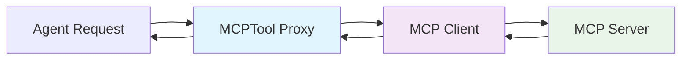

# MCPTool

The `MCPTool` class represents individual tools discovered from MCP servers. Each MCPTool acts as a lightweight proxy that delegates execution to its parent MCP client while providing a standardized tool interface within the OxyGent system.

## Class Overview

```python
from oxygent.oxy.mcp_tools import MCPTool
from oxygent.oxy.base_tool import BaseTool

class MCPTool(BaseTool):
    """Individual tool proxy for MCP server tools."""
```

### Inheritance Hierarchy
```
MCPTool → BaseTool → Oxy
```

## Core Attributes

### `mcp_client: Any`
Reference to the parent MCP client that handles actual execution. Excluded from serialization.

### `server_name: str`
Name of the MCP server that provides this tool.

### `is_permission_required: bool`
Whether the tool requires explicit permission before execution. Defaults to `True` for security.

## Key Features

- **Lightweight Proxy**: Minimal overhead, delegates execution to parent client
- **Automatic Discovery**: Created automatically during MCP server tool discovery
- **Standardized Interface**: Provides consistent `BaseTool` interface
- **Permission Control**: Inherits security model from parent client
- **Input Schema**: Preserves original tool schema from MCP server

## Architecture



## Creation Process

MCPTool instances are created automatically during MCP server initialization:

```python
# 1. MCP Client discovers tools from server
await mcp_client.init()

# 2. BaseMCPClient.add_tools() creates MCPTool instances
for tool in discovered_tools:
    mcp_tool = MCPTool(
        name=tool.name,
        desc=tool.description,
        mcp_client=mcp_client,       # Parent client reference
        server_name=mcp_client.name,
        input_schema=tool.inputSchema,
        **inherited_params
    )
    
    # 3. MCPTool registered with MAS
    mcp_tool.set_mas(mas)
    mas.add_oxy(mcp_tool)
```

## Execution Flow

### `async _execute(oxy_request: OxyRequest) -> OxyResponse`

Delegates execution to the parent MCP client.

```python
async def _execute(self, oxy_request: OxyRequest) -> OxyResponse:
    """Execute the MCP tool by delegating to the parent MCP client."""
    return await self.mcp_client._execute(oxy_request)
```

**Process:**
1. Receives `OxyRequest` with tool call details
2. Delegates to parent `mcp_client._execute()`
3. Parent client handles MCP protocol communication
4. Returns `OxyResponse` with results

## Usage Examples

### Direct Access (Not Recommended)

```python
# MCPTool instances are typically not created directly
# They are auto-generated during MCP client initialization

# Direct creation (for testing/debugging only)
tool = MCPTool(
    name="read_file",
    desc="Read file contents",
    mcp_client=existing_mcp_client,
    server_name="filesystem_server",
    input_schema={
        "properties": {
            "path": {"type": "string", "description": "File path to read"}
        },
        "required": ["path"]
    }
)

# Direct execution
response = await tool._execute(OxyRequest(
    callee="read_file",
    arguments={"path": "/tmp/test.txt"}
))
```

### Typical Usage Through Agents

```python
# 1. Initialize MCP client (creates MCPTool instances automatically)
fs_client = StdioMCPClient(name="filesystem", params=fs_params)
await fs_client.init()  # Discovers tools, creates MCPTool proxies

# 2. Add to agent (MCPTool instances are included)
agent = ChatAgent(name="file_agent")
agent.add_oxy(fs_client)  # Includes all discovered MCPTool instances

# 3. Agent uses MCPTool through standard interface
response = await agent.execute(OxyRequest(
    callee="read_file",      # MCPTool name
    arguments={"path": "/tmp/example.txt"}
))

# Execution flows: Agent → MCPTool → MCP Client → MCP Server
```

### Discovery and Inspection

```python
# Inspect discovered MCPTool instances
mcp_client = StdioMCPClient(name="filesystem", params=fs_params)
await mcp_client.init()

# List all tools created
print(f"Discovered tools: {mcp_client.included_tool_name_list}")

# Access MCPTool instances through MAS
mas = mcp_client.mas
mcp_tools = [oxy for oxy in mas.oxys if isinstance(oxy, MCPTool)]

for tool in mcp_tools:
    print(f"Tool: {tool.name}")
    print(f"Description: {tool.desc}")
    print(f"Server: {tool.server_name}")
    print(f"Schema: {tool.input_schema}")
    print(f"Permission required: {tool.is_permission_required}")
```

## Integration Examples

### With Multiple MCP Servers

```python
# Multiple MCP clients create multiple MCPTool instances
servers = [
    StdioMCPClient(name="filesystem", params=fs_params),
    SSEMCPClient(name="realtime", sse_url="https://sse.example.com"),
    StreamableMCPClient(name="api", server_url="https://api.example.com")
]

# Initialize all servers (creates MCPTool instances)
for server in servers:
    server.set_mas(mas)
    await server.init()

# Count total MCPTool instances
all_mcp_tools = [oxy for oxy in mas.oxys if isinstance(oxy, MCPTool)]
print(f"Total MCP tools available: {len(all_mcp_tools)}")

# Group by server
by_server = {}
for tool in all_mcp_tools:
    if tool.server_name not in by_server:
        by_server[tool.server_name] = []
    by_server[tool.server_name].append(tool.name)

for server, tools in by_server.items():
    print(f"{server}: {tools}")
```

### With Workflow Integration

```python
# MCPTool instances available as workflow steps
workflow = WorkflowFlow(name="mcp_workflow")

# Add MCP clients (includes their MCPTool instances)
workflow.add_oxy(fs_client)
workflow.add_oxy(api_client)

# Define workflow using MCPTool names
workflow_config = {
    "steps": [
        {
            "name": "read_config",
            "tool": "read_file",      # MCPTool from filesystem server
            "arguments": {"path": "/config/settings.json"}
        },
        {
            "name": "fetch_data", 
            "tool": "api_call",       # MCPTool from API server
            "arguments": {"endpoint": "/data", "config": "{read_config.output}"}
        },
        {
            "name": "save_result",
            "tool": "write_file",     # MCPTool from filesystem server
            "arguments": {"path": "/output/result.json", "content": "{fetch_data.output}"}
        }
    ]
}
```

## Metadata and Properties

### Tool Information Access

```python
# Access MCPTool properties
for tool in mcp_tools:
    # Basic tool information
    print(f"Name: {tool.name}")
    print(f"Description: {tool.desc}")
    print(f"Category: {tool.category}")  # Always "tool"
    
    # MCP-specific information
    print(f"Server: {tool.server_name}")
    print(f"Parent Client: {tool.mcp_client.name}")
    
    # Security settings
    print(f"Permission Required: {tool.is_permission_required}")
    
    # Schema information
    print(f"Input Schema: {tool.input_schema}")
    if "properties" in tool.input_schema:
        print(f"Parameters: {list(tool.input_schema['properties'].keys())}")
        print(f"Required: {tool.input_schema.get('required', [])}")
```

### Dynamic Tool Filtering

```python
class MCPToolFilter:
    """Utility class for filtering MCPTool instances."""
    
    @staticmethod
    def by_server(tools: list[MCPTool], server_name: str) -> list[MCPTool]:
        """Filter tools by server name."""
        return [tool for tool in tools if tool.server_name == server_name]
    
    @staticmethod
    def by_permission(tools: list[MCPTool], requires_permission: bool) -> list[MCPTool]:
        """Filter tools by permission requirement."""
        return [tool for tool in tools if tool.is_permission_required == requires_permission]
    
    @staticmethod
    def by_parameter(tools: list[MCPTool], parameter_name: str) -> list[MCPTool]:
        """Filter tools that accept a specific parameter."""
        filtered = []
        for tool in tools:
            if "properties" in tool.input_schema:
                if parameter_name in tool.input_schema["properties"]:
                    filtered.append(tool)
        return filtered

# Usage
all_tools = [oxy for oxy in mas.oxys if isinstance(oxy, MCPTool)]

# Get filesystem tools
fs_tools = MCPToolFilter.by_server(all_tools, "filesystem")

# Get tools that don't require permission
public_tools = MCPToolFilter.by_permission(all_tools, False)

# Get tools that accept 'path' parameter
path_tools = MCPToolFilter.by_parameter(all_tools, "path")
```

## Advanced Features

### Custom MCPTool Wrapper

```python
class EnhancedMCPTool(MCPTool):
    """Enhanced MCPTool with additional features."""
    
    def __init__(self, **kwargs):
        super().__init__(**kwargs)
        self.execution_count = 0
        self.last_execution = None
        self.error_count = 0
    
    async def _execute(self, oxy_request: OxyRequest) -> OxyResponse:
        """Execute with enhanced tracking."""
        self.execution_count += 1
        self.last_execution = time.time()
        
        try:
            response = await super()._execute(oxy_request)
            if response.state == OxyState.FAILED:
                self.error_count += 1
            return response
        except Exception as e:
            self.error_count += 1
            raise
    
    def get_stats(self) -> dict:
        """Get execution statistics."""
        return {
            "execution_count": self.execution_count,
            "error_count": self.error_count,
            "last_execution": self.last_execution,
            "error_rate": self.error_count / max(self.execution_count, 1)
        }
```

### Tool Registry

```python
class MCPToolRegistry:
    """Registry for managing MCPTool instances."""
    
    def __init__(self):
        self.tools = {}
        self.servers = {}
    
    def register_from_client(self, mcp_client):
        """Register all tools from an MCP client."""
        if not hasattr(mcp_client, 'mas') or not mcp_client.mas:
            return
        
        mcp_tools = [oxy for oxy in mcp_client.mas.oxys if isinstance(oxy, MCPTool)]
        
        for tool in mcp_tools:
            self.tools[tool.name] = tool
            if tool.server_name not in self.servers:
                self.servers[tool.server_name] = []
            self.servers[tool.server_name].append(tool.name)
    
    def get_tool(self, name: str) -> MCPTool:
        """Get tool by name."""
        return self.tools.get(name)
    
    def list_tools_by_server(self, server_name: str) -> list[str]:
        """List tool names for a specific server."""
        return self.servers.get(server_name, [])
    
    def get_tool_info(self, name: str) -> dict:
        """Get comprehensive tool information."""
        tool = self.get_tool(name)
        if not tool:
            return None
        
        return {
            "name": tool.name,
            "description": tool.desc,
            "server": tool.server_name,
            "input_schema": tool.input_schema,
            "permission_required": tool.is_permission_required,
            "client_type": type(tool.mcp_client).__name__
        }
```

## Performance Considerations

### Proxy Overhead

MCPTool instances have minimal overhead:
- **Memory**: Small footprint, mainly metadata storage
- **CPU**: Single delegation call to parent client
- **Network**: No additional network calls, uses parent client connection

### Optimization Strategies

```python
# ✅ Good: Reuse MCPTool instances
# MCPTool instances are created once and reused
agent.add_oxy(mcp_client)  # All MCPTool instances added once

# ❌ Bad: Creating new MCPTool instances
# Don't create MCPTool instances manually for existing tools
```

## Error Handling

### Delegation Error Handling

```python
class RobustMCPTool(MCPTool):
    """MCPTool with enhanced error handling."""
    
    async def _execute(self, oxy_request: OxyRequest) -> OxyResponse:
        """Execute with comprehensive error handling."""
        try:
            # Check if parent client is available
            if not self.mcp_client:
                return OxyResponse(
                    state=OxyState.FAILED,
                    output="MCP client not available"
                )
            
            # Delegate to parent client
            return await self.mcp_client._execute(oxy_request)
            
        except AttributeError as e:
            # Parent client missing method
            return OxyResponse(
                state=OxyState.FAILED,
                output=f"MCP client method not available: {e}"
            )
        except Exception as e:
            # Unexpected error
            logger.error(f"MCPTool {self.name} execution error: {e}")
            return OxyResponse(
                state=OxyState.FAILED,
                output=f"Tool execution error: {str(e)}"
            )
```

## Best Practices

### Tool Inspection

```python
# ✅ Good: Inspect tools before use
def inspect_mcp_tools(mas):
    """Inspect available MCP tools."""
    mcp_tools = [oxy for oxy in mas.oxys if isinstance(oxy, MCPTool)]
    
    print(f"Total MCP tools: {len(mcp_tools)}")
    
    for tool in mcp_tools:
        print(f"\nTool: {tool.name}")
        print(f"  Server: {tool.server_name}")
        print(f"  Description: {tool.desc}")
        
        if "properties" in tool.input_schema:
            params = tool.input_schema["properties"]
            required = tool.input_schema.get("required", [])
            
            print(f"  Parameters:")
            for param, details in params.items():
                req_marker = " (required)" if param in required else ""
                print(f"    - {param}: {details.get('type', 'unknown')}{req_marker}")
                if details.get('description'):
                    print(f"      {details['description']}")

# Usage
inspect_mcp_tools(mas)
```

### Error Handling

```python
# ✅ Good: Handle MCPTool execution errors
async def safe_mcp_tool_execution(tool: MCPTool, request: OxyRequest):
    """Safely execute MCPTool with error handling."""
    try:
        response = await tool._execute(request)
        if response.state == OxyState.FAILED:
            logger.error(f"Tool {tool.name} failed: {response.output}")
        return response
    except Exception as e:
        logger.error(f"Unexpected error executing {tool.name}: {e}")
        return OxyResponse(state=OxyState.FAILED, output=str(e))
```

## API Reference

### Complete Class Definition

```python
class MCPTool(BaseTool):
    """Individual tool proxy for MCP server tools."""
    
    is_permission_required: bool = Field(True, description="")
    mcp_client: Any = Field(None, exclude=True)
    server_name: str = Field("")
    
    async def _execute(self, oxy_request: OxyRequest) -> OxyResponse:
        """Execute the MCP tool by delegating to the parent MCP client."""
```

### Inherited Properties

From `BaseTool`:
- `category: str = "tool"`
- `timeout: float = 60`

From `Oxy`:
- `name: str`
- `desc: str`
- `input_schema: dict`
- `mas: Optional[MAS] = None`

### Creation Parameters

```python
MCPTool(
    name=str,                    # Tool name from MCP server
    desc=str,                    # Tool description from MCP server  
    mcp_client=BaseMCPClient,    # Parent MCP client reference
    server_name=str,             # MCP server name
    input_schema=dict,           # Tool input schema from MCP server
    **inherited_params           # Parameters from parent client
)
```

## See Also

- [BaseMCPClient](./base-mcp-client) - Base MCP client functionality
- [StdioMCPClient](./stdio-mcp-client) - Standard I/O MCP client
- [SSEMCPClient](./sse-mcp-client) - Server-Sent Events MCP client
- [StreamableMCPClient](./streamable-mcp-client) - Streamable HTTP MCP client
- [BaseTool](/agents/base-agent) - Base tool interface