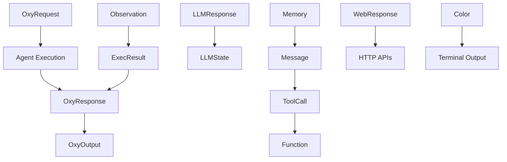

# Schema Overview

The OxyGent framework utilizes Pydantic models to define structured schemas for data validation, serialization, and type safety across all system components. These schemas provide the foundation for agent communication, request handling, and response processing in the multi-agent ecosystem.

## Architecture

The schema system is organized into several key categories, each serving specific aspects of the OxyGent framework:

### Core Schemas
- **[Oxy](./oxy)**: Central request-response and state management schemas
- **[Memory](./memory)**: Chat messages and conversation memory management

### Service Integration Schemas  
- **[LLM](./llm)**: Large Language Model response and state handling
- **[Web](./web)**: Web API response standardization

### Execution & Monitoring Schemas
- **[Observation](./observation)**: Execution result tracking and multimodal content
- **[Color](./color)**: Terminal color representation for logging and output

## Schema Hierarchy



## Import Patterns

All schemas are available through the main schemas module:

```python
from oxygent.schemas import (
    # Core schemas
    OxyState, OxyRequest, OxyResponse, OxyOutput,
    
    # Memory and messaging
    Message, Memory,
    
    # LLM integration
    LLMState, LLMResponse,
    
    # Execution tracking
    Observation, ExecResult,
    
    # Service responses
    WebResponse,
    
    # Utilities
    Color
)
```

## Common Usage Patterns

### Request-Response Flow

The fundamental pattern for agent interaction uses OxyRequest and OxyResponse:

```python
from oxygent.schemas import OxyRequest, OxyResponse, OxyState

# Create request
request = OxyRequest(
    caller="user",
    callee="search_agent", 
    arguments={"query": "Python asyncio tutorial"}
)

# Process request (in agent)
# ... processing logic ...

# Create response
response = OxyResponse(
    state=OxyState.COMPLETED,
    output="Found 5 relevant tutorials on Python asyncio"
)
```

### Conversation Management

Memory and Message schemas handle conversational AI interactions:

```python
from oxygent.schemas import Memory, Message

# Initialize conversation memory
memory = Memory(max_messages=50)

# Add conversation messages
memory.add_message(Message.system_message("You are a helpful assistant"))
memory.add_message(Message.user_message("Explain Python decorators"))
memory.add_message(Message.assistant_message("Python decorators are..."))

# Convert for API usage
api_messages = memory.to_dict_list()
```

### Multi-Agent Execution Tracking

Observation schemas track execution results across multiple agents:

```python
from oxygent.schemas import Observation, ExecResult, OxyResponse, OxyState

# Create observation for workflow tracking
workflow_observation = Observation()

# Add execution results
exec_result = ExecResult(
    executor="search_agent",
    oxy_response=OxyResponse(
        state=OxyState.COMPLETED,
        output="Search completed: 10 results found"
    )
)

workflow_observation.add_exec_result(exec_result)

# Generate summary
summary = workflow_observation.to_str()
```

## Schema Features

### Type Safety

All schemas use Pydantic for runtime type validation:

```python
from oxygent.schemas import OxyRequest
from pydantic import ValidationError

try:
    # Valid request
    request = OxyRequest(callee="agent_name")
    
    # Invalid request - will raise ValidationError
    invalid_request = OxyRequest(callee=123)  # Wrong type
except ValidationError as e:
    print(f"Validation error: {e}")
```

### Serialization

Schemas provide built-in JSON serialization capabilities:

```python
from oxygent.schemas import WebResponse

response = WebResponse(
    code=200,
    message="Success",
    data={"user_id": 123, "name": "Alice"}
)

# Convert to dictionary
response_dict = response.to_dict()

# JSON serialization
import json
json_str = json.dumps(response_dict)
```

### Default Values

Schemas include sensible defaults for optional fields:

```python
from oxygent.schemas import OxyRequest, Memory, WebResponse

# OxyRequest with defaults
request = OxyRequest(callee="agent")
# Automatically generates: request_id, current_trace_id, etc.

# Memory with default configuration
memory = Memory()  # max_messages=50, messages=[]

# WebResponse with default success
response = WebResponse()  # code=200, message="SUCCESS", data={}
```

## Advanced Schema Usage

### Schema Composition

Schemas can be composed for complex data structures:

```python
from oxygent.schemas import OxyResponse, OxyOutput, OxyState

# Response with structured output and attachments
complex_response = OxyResponse(
    state=OxyState.COMPLETED,
    output=OxyOutput(
        result={
            "analysis": "Document processed successfully",
            "pages": 15,
            "word_count": 2500
        },
        attachments=[
            {"type": "pdf", "url": "processed_document.pdf"},
            {"type": "summary", "content": "Executive summary..."}
        ]
    ),
    extra={
        "processing_time": 2.3,
        "model_used": "gpt-4",
        "tokens": 1500
    }
)
```

### Schema Inheritance

Some schemas can be extended for specific use cases:

```python
from oxygent.schemas import WebResponse
from pydantic import BaseModel, Field
from typing import List

class PaginatedWebResponse(WebResponse):
    """Extended WebResponse with pagination support."""
    
    @classmethod
    def paginated(cls, items: List, page: int, per_page: int, total: int):
        return cls(
            code=200,
            message="Data retrieved successfully",
            data={
                "items": items,
                "pagination": {
                    "page": page,
                    "per_page": per_page,
                    "total": total,
                    "total_pages": (total + per_page - 1) // per_page
                }
            }
        )

# Usage
paginated_response = PaginatedWebResponse.paginated(
    items=[{"id": 1}, {"id": 2}],
    page=1,
    per_page=10, 
    total=25
)
```

### Schema Validation Middleware

Create validation middleware using schemas:

```python
from oxygent.schemas import OxyRequest, OxyResponse, OxyState
from pydantic import ValidationError
import logging

async def validate_request_middleware(request: OxyRequest) -> OxyRequest:
    """Validate request structure."""
    try:
        # Validate required fields
        if not request.callee:
            raise ValueError("Request must specify callee")
        
        if not request.current_trace_id:
            import shortuuid
            request.current_trace_id = shortuuid.ShortUUID().random(length=16)
        
        # Log validation success
        logging.info(f"Request validation passed", extra={
            "trace_id": request.current_trace_id,
            "callee": request.callee
        })
        
        return request
        
    except (ValueError, ValidationError) as e:
        logging.error(f"Request validation failed: {e}")
        raise
```

## Schema Integration Examples

### FastAPI Integration

Schemas integrate seamlessly with FastAPI for web API development:

```python
from fastapi import FastAPI, HTTPException
from oxygent.schemas import WebResponse
from pydantic import BaseModel

app = FastAPI()

class UserQuery(BaseModel):
    question: str
    context: str = ""

@app.post("/ask", response_model=WebResponse)
async def ask_question(query: UserQuery):
    """Ask a question to the AI agent."""
    try:
        # Process question with OxyGent agents
        request = OxyRequest(
            callee="qa_agent",
            arguments=query.dict()
        )
        
        # Execute request
        # response = await agent.execute(request)
        
        return WebResponse(
            code=200,
            message="Question processed successfully",
            data={"answer": "AI response here..."}
        )
        
    except Exception as e:
        return WebResponse(
            code=500,
            message="Processing failed",
            data={"error": str(e)}
        )
```

### Database Integration

Schemas can be used with database ORMs:

```python
from sqlalchemy import Column, String, Text, DateTime
from sqlalchemy.ext.declarative import declarative_base
from oxygent.schemas import OxyRequest, OxyResponse
import json

Base = declarative_base()

class RequestLog(Base):
    """Database model for request logging."""
    __tablename__ = "request_logs"
    
    id = Column(String, primary_key=True)
    trace_id = Column(String, index=True)
    caller = Column(String)
    callee = Column(String)
    request_data = Column(Text)
    response_data = Column(Text)
    created_at = Column(DateTime)
    
    @classmethod
    def from_oxy_request(cls, request: OxyRequest, response: OxyResponse = None):
        """Create log entry from OxyRequest and OxyResponse."""
        return cls(
            id=request.request_id,
            trace_id=request.current_trace_id,
            caller=request.caller,
            callee=request.callee,
            request_data=json.dumps(request.dict()),
            response_data=json.dumps(response.dict()) if response else None
        )
```

### Event System Integration

Use schemas for event-driven architectures:

```python
from oxygent.schemas import OxyRequest, OxyResponse, OxyState
from typing import Dict, List, Callable
import asyncio

class EventBus:
    """Event bus using OxyGent schemas."""
    
    def __init__(self):
        self.listeners: Dict[str, List[Callable]] = {}
    
    def subscribe(self, event_type: str, callback: Callable):
        """Subscribe to events."""
        if event_type not in self.listeners:
            self.listeners[event_type] = []
        self.listeners[event_type].append(callback)
    
    async def publish_request(self, request: OxyRequest):
        """Publish request event."""
        await self._publish("request_started", {
            "trace_id": request.current_trace_id,
            "callee": request.callee,
            "arguments": request.arguments
        })
    
    async def publish_response(self, response: OxyResponse):
        """Publish response event."""
        event_type = "request_completed" if response.state == OxyState.COMPLETED else "request_failed"
        await self._publish(event_type, {
            "state": response.state.name,
            "output": str(response.output)[:100],  # Truncated
            "extra": response.extra
        })
    
    async def _publish(self, event_type: str, data: dict):
        """Internal publish method."""
        if event_type in self.listeners:
            tasks = [callback(data) for callback in self.listeners[event_type]]
            await asyncio.gather(*tasks, return_exceptions=True)

# Usage
event_bus = EventBus()

async def log_request(data):
    print(f"Request started: {data['callee']}")

async def log_completion(data):
    print(f"Request completed: {data['state']}")

event_bus.subscribe("request_started", log_request)
event_bus.subscribe("request_completed", log_completion)
```

## Performance Considerations

### Memory Usage

Schemas are designed for efficient memory usage:

```python
from oxygent.schemas import Memory, OxyRequest

# Memory automatically manages size
memory = Memory(max_messages=20)  # Limits memory footprint

# Use short memory for API calls to reduce token usage
api_messages = memory.to_dict_list(short_memory_size=5)

# Clean up request objects when done
request = OxyRequest(callee="agent")
# ... use request ...
del request  # Explicit cleanup for large request objects
```

### Serialization Performance

Optimize serialization for high-throughput scenarios:

```python
import json
from oxygent.schemas import WebResponse

# Pre-serialize common responses
SUCCESS_RESPONSE_TEMPLATE = WebResponse(code=200, message="SUCCESS").to_dict()

def create_fast_response(data):
    """Create response using pre-serialized template."""
    response_dict = SUCCESS_RESPONSE_TEMPLATE.copy()
    response_dict["data"] = data
    return response_dict

# Batch processing
responses = []
for item in large_dataset:
    response = create_fast_response({"processed": item})
    responses.append(response)
```

### Validation Optimization

Optimize validation for performance-critical paths:

```python
from oxygent.schemas import OxyRequest
from pydantic import ValidationError

def fast_request_create(callee: str, arguments: dict):
    """Optimized request creation with minimal validation."""
    try:
        # Skip some validation for trusted internal calls
        request = OxyRequest.construct(  # bypass validation
            callee=callee,
            arguments=arguments,
            caller="internal"
        )
        
        # Only validate critical fields
        if not callee:
            raise ValueError("callee is required")
            
        return request
        
    except Exception as e:
        # Fallback to full validation
        return OxyRequest(callee=callee, arguments=arguments)
```

## Migration Guide

When upgrading schemas, follow these patterns:

### Version Compatibility

```python
from oxygent.schemas import OxyRequest
from typing import Union, Dict, Any

def handle_legacy_request(request_data: Union[Dict[str, Any], OxyRequest]) -> OxyRequest:
    """Handle both legacy dict format and new OxyRequest schema."""
    
    if isinstance(request_data, dict):
        # Convert legacy format
        return OxyRequest(
            callee=request_data.get("target", ""),
            arguments=request_data.get("params", {}),
            caller=request_data.get("source", "user")
        )
    
    return request_data  # Already new format
```

### Schema Evolution

```python
from oxygent.schemas import WebResponse
from pydantic import BaseModel, Field
from typing import Optional

class WebResponseV2(WebResponse):
    """Extended WebResponse with additional fields."""
    version: str = Field(default="v2")
    request_id: Optional[str] = Field(default=None)
    
    @classmethod
    def from_v1(cls, v1_response: WebResponse, request_id: str = None):
        """Convert v1 response to v2."""
        return cls(
            code=v1_response.code,
            message=v1_response.message,
            data=v1_response.data,
            request_id=request_id
        )
```

## Troubleshooting

### Common Validation Errors

```python
from oxygent.schemas import OxyRequest
from pydantic import ValidationError

try:
    # This will fail - missing required callee
    request = OxyRequest(caller="user")
except ValidationError as e:
    print("Validation errors:")
    for error in e.errors():
        print(f"  Field: {error['loc']}")
        print(f"  Message: {error['msg']}")
        print(f"  Input: {error['input']}")
```

### Schema Debugging

```python
from oxygent.schemas import OxyRequest
import json

request = OxyRequest(callee="test_agent")

# Inspect schema structure
print("Schema fields:")
for field_name, field_info in request.__fields__.items():
    print(f"  {field_name}: {field_info.type_}")

# Export for debugging
debug_data = request.dict()
print(json.dumps(debug_data, indent=2, default=str))
```

## Related Documentation

### Core Components
- **[Agents](../agents/)**: How schemas integrate with agent systems
- **[Flows](../flows/)**: Schema usage in workflow orchestration

### Integration Guides
- **[LLM Integration](../llms/)**: Using LLM schemas with language models
- **[Database Integration](../databases/)**: Persisting schema data
- **[Web APIs](../apis/)**: HTTP API integration patterns

### Utilities
- **[Configuration](../utils/config)**: Schema configuration management
- **[Logging](../utils/logging)**: Schema-aware logging patterns

## Best Practices Summary

1. **Use Type Hints**: Always use proper type hints with schemas
2. **Validate Early**: Validate input data as early as possible
3. **Handle Errors Gracefully**: Provide meaningful error messages
4. **Optimize for Use Case**: Choose appropriate schema configurations
5. **Document Custom Extensions**: Document any schema customizations
6. **Test Schema Changes**: Thoroughly test schema modifications
7. **Version Compatibility**: Maintain backward compatibility when possible
8. **Resource Management**: Clean up large schema objects when done

The OxyGent schema system provides a robust foundation for building scalable, maintainable multi-agent applications with strong type safety and data validation capabilities.