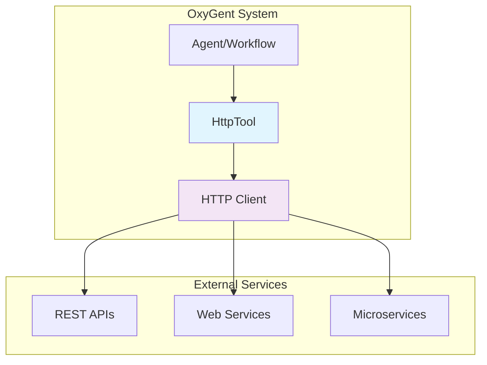

# API Tools Overview

The API Tools system provides HTTP-based integration capabilities for connecting OxyGent to external APIs and web services. It offers a standardized way to make HTTP requests with configurable methods, headers, and parameters while maintaining proper timeout handling and error management.

## Architecture Overview

The API Tools system is currently centered around HTTP communication:



## Core Component

### [HttpTool](./http-tool)
The primary tool for HTTP-based API integration, supporting:
- Multiple HTTP methods (GET, POST, PUT, DELETE, etc.)
- Configurable headers and authentication
- Parameter merging and request customization
- Timeout management and error handling
- Async execution with httpx client

## Quick Start

### Basic API Integration

```python
from oxygent.oxy.api_tools import HttpTool

# Simple GET request tool
api_tool = HttpTool(
    name="weather_api",
    desc="Fetch weather information",
    method="GET",
    url="https://api.weather.com/v1/current",
    headers={"API-Key": "your-api-key"},
    default_params={"format": "json"}
)

# Execute API call
response = await api_tool._execute(OxyRequest(
    callee="weather_api",
    arguments={"location": "New York"}
))
```

### RESTful API Integration

```python
# Multiple HTTP tools for complete API coverage
weather_tools = [
    HttpTool(
        name="get_weather",
        desc="Get current weather",
        method="GET",
        url="https://api.weather.com/v1/current",
        headers={"Authorization": f"Bearer {api_token}"}
    ),
    HttpTool(
        name="get_forecast",
        desc="Get weather forecast", 
        method="GET",
        url="https://api.weather.com/v1/forecast",
        headers={"Authorization": f"Bearer {api_token}"}
    ),
    HttpTool(
        name="update_location",
        desc="Update user location",
        method="PUT",
        url="https://api.weather.com/v1/user/location",
        headers={
            "Authorization": f"Bearer {api_token}",
            "Content-Type": "application/json"
        }
    )
]

# Add to agent
weather_agent = ChatAgent(name="weather_assistant")
for tool in weather_tools:
    weather_agent.add_oxy(tool)
```

## Key Features

### 🌐 HTTP Method Support
- Full support for all HTTP methods
- GET, POST, PUT, DELETE, PATCH, HEAD, OPTIONS
- Method-specific parameter handling

### 🔐 Authentication & Headers
- Flexible header configuration
- Support for various authentication schemes
- API key, Bearer token, Basic auth compatible

### ⚙️ Parameter Management
- Default parameter configuration
- Request-time parameter merging
- Query parameter and body handling

### ⏱️ Timeout & Error Handling
- Configurable request timeouts
- Comprehensive error handling
- HTTP status code processing

### 🚀 Async Performance
- Built on httpx async client
- Non-blocking HTTP operations
- Connection pooling support

## Integration Examples

### Microservices Communication

```python
# Define microservice endpoints
services = {
    "user_service": "https://users.company.com/api",
    "order_service": "https://orders.company.com/api", 
    "inventory_service": "https://inventory.company.com/api"
}

# Create HTTP tools for each service
service_tools = []
for service_name, base_url in services.items():
    for operation in ["get", "create", "update", "delete"]:
        tool = HttpTool(
            name=f"{service_name}_{operation}",
            desc=f"{operation.title()} operations for {service_name}",
            method="GET" if operation == "get" else "POST",
            url=f"{base_url}/{operation}",
            headers={
                "Authorization": f"Bearer {get_service_token(service_name)}",
                "Content-Type": "application/json"
            }
        )
        service_tools.append(tool)

# Add to orchestration agent
orchestrator = ChatAgent(name="service_orchestrator")
for tool in service_tools:
    orchestrator.add_oxy(tool)
```

### Third-Party API Integration

```python
# Social media API integration
social_apis = [
    HttpTool(
        name="post_to_twitter",
        desc="Post message to Twitter",
        method="POST",
        url="https://api.twitter.com/2/tweets",
        headers={
            "Authorization": f"Bearer {twitter_token}",
            "Content-Type": "application/json"
        }
    ),
    HttpTool(
        name="post_to_linkedin",
        desc="Post message to LinkedIn",
        method="POST", 
        url="https://api.linkedin.com/v2/shares",
        headers={
            "Authorization": f"Bearer {linkedin_token}",
            "Content-Type": "application/json"
        }
    ),
    HttpTool(
        name="upload_to_imgur",
        desc="Upload image to Imgur",
        method="POST",
        url="https://api.imgur.com/3/image",
        headers={"Authorization": f"Client-ID {imgur_client_id}"}
    )
]

# Social media management agent
social_agent = ChatAgent(name="social_media_manager")
for tool in social_apis:
    social_agent.add_oxy(tool)
```

### Data Pipeline Integration

```python
# Data processing pipeline tools
pipeline_tools = [
    HttpTool(
        name="fetch_raw_data",
        desc="Fetch raw data from source",
        method="GET",
        url="https://data-source.com/api/raw",
        headers={"API-Key": data_source_key},
        default_params={"format": "json", "limit": 1000}
    ),
    HttpTool(
        name="submit_for_processing",
        desc="Submit data for processing",
        method="POST",
        url="https://processor.com/api/process",
        headers={
            "Authorization": f"Bearer {processor_token}",
            "Content-Type": "application/json"
        }
    ),
    HttpTool(
        name="store_results",
        desc="Store processed results", 
        method="POST",
        url="https://storage.com/api/store",
        headers={
            "Authorization": f"Bearer {storage_token}",
            "Content-Type": "application/json"
        }
    )
]

# Data pipeline workflow
pipeline_workflow = WorkflowFlow(name="data_pipeline")
for tool in pipeline_tools:
    pipeline_workflow.add_oxy(tool)

# Define pipeline steps
workflow_config = {
    "steps": [
        {
            "name": "extract",
            "tool": "fetch_raw_data",
            "arguments": {"source": "production"}
        },
        {
            "name": "process",
            "tool": "submit_for_processing",
            "arguments": {"data": "{extract.output}"}
        },
        {
            "name": "store",
            "tool": "store_results",
            "arguments": {"results": "{process.output}"}
        }
    ]
}
```

## Advanced Configuration

### Authentication Patterns

```python
# API Key authentication
api_key_tool = HttpTool(
    name="api_key_service",
    headers={"X-API-Key": "your-api-key"}
)

# Bearer token authentication
bearer_tool = HttpTool(
    name="bearer_service", 
    headers={"Authorization": f"Bearer {access_token}"}
)

# Basic authentication
import base64
credentials = base64.b64encode(b"username:password").decode()
basic_auth_tool = HttpTool(
    name="basic_auth_service",
    headers={"Authorization": f"Basic {credentials}"}
)

# Custom authentication
custom_auth_tool = HttpTool(
    name="custom_auth_service",
    headers={
        "X-Auth-Token": custom_token,
        "X-Client-ID": client_id,
        "X-Timestamp": str(int(time.time()))
    }
)
```

### Environment-Based Configuration

```python
import os

class APIConfig:
    """Environment-based API configuration."""
    
    @classmethod
    def get_service_config(cls, service_name: str) -> dict:
        """Get service configuration from environment."""
        prefix = f"{service_name.upper()}_"
        
        return {
            "url": os.getenv(f"{prefix}URL"),
            "headers": {
                "Authorization": f"Bearer {os.getenv(f'{prefix}TOKEN')}",
                "User-Agent": os.getenv(f"{prefix}USER_AGENT", "OxyGent/1.0")
            },
            "timeout": float(os.getenv(f"{prefix}TIMEOUT", "30.0"))
        }

# Usage
payment_config = APIConfig.get_service_config("payment")
payment_tool = HttpTool(
    name="payment_api",
    desc="Payment processing API",
    method="POST",
    **payment_config
)
```

### Rate Limiting and Retry

```python
class RateLimitedHttpTool(HttpTool):
    """HttpTool with rate limiting and retry logic."""
    
    def __init__(self, max_requests_per_minute=60, max_retries=3, **kwargs):
        super().__init__(**kwargs)
        self.max_requests_per_minute = max_requests_per_minute
        self.max_retries = max_retries
        self.request_times = []
    
    async def _execute(self, oxy_request: OxyRequest) -> OxyResponse:
        """Execute with rate limiting and retry logic."""
        # Rate limiting
        await self._enforce_rate_limit()
        
        # Retry logic
        last_exception = None
        for attempt in range(self.max_retries + 1):
            try:
                response = await super()._execute(oxy_request)
                if attempt > 0:
                    logger.info(f"Request succeeded on attempt {attempt + 1}")
                return response
            except Exception as e:
                last_exception = e
                if attempt < self.max_retries:
                    delay = 2 ** attempt  # Exponential backoff
                    logger.warning(f"Request failed (attempt {attempt + 1}), retrying in {delay}s")
                    await asyncio.sleep(delay)
        
        # All retries failed
        return OxyResponse(
            state=OxyState.FAILED,
            output=f"Request failed after {self.max_retries} retries: {last_exception}"
        )
    
    async def _enforce_rate_limit(self):
        """Enforce rate limiting."""
        current_time = time.time()
        
        # Remove requests older than 1 minute
        self.request_times = [t for t in self.request_times if current_time - t < 60]
        
        # Check if we've exceeded the rate limit
        if len(self.request_times) >= self.max_requests_per_minute:
            sleep_time = 60 - (current_time - self.request_times[0])
            if sleep_time > 0:
                logger.info(f"Rate limit reached, sleeping for {sleep_time:.2f}s")
                await asyncio.sleep(sleep_time)
        
        # Record this request time
        self.request_times.append(current_time)
```

## Security Best Practices

### Secure Configuration

```python
# ✅ Good: Environment-based secrets
secure_tool = HttpTool(
    name="secure_api",
    url=os.getenv("API_URL"),
    headers={
        "Authorization": f"Bearer {os.getenv('API_TOKEN')}",
        "X-API-Key": os.getenv("API_KEY")
    }
)

# ❌ Bad: Hardcoded secrets
insecure_tool = HttpTool(
    name="insecure_api",
    headers={"Authorization": "Bearer hardcoded-token-123"}
)
```

### HTTPS Enforcement

```python
def validate_https_url(url: str) -> str:
    """Ensure URL uses HTTPS in production."""
    if not url.startswith('https://') and not url.startswith('http://localhost'):
        raise ValueError(f"HTTPS required for production APIs: {url}")
    return url

# Production-safe tool creation
def create_secure_http_tool(name: str, url: str, **kwargs) -> HttpTool:
    """Create HttpTool with security validation."""
    return HttpTool(
        name=name,
        url=validate_https_url(url),
        **kwargs
    )
```

### Request Validation

```python
class ValidatedHttpTool(HttpTool):
    """HttpTool with request validation."""
    
    def __init__(self, allowed_params=None, **kwargs):
        super().__init__(**kwargs)
        self.allowed_params = allowed_params or []
    
    async def _execute(self, oxy_request: OxyRequest) -> OxyResponse:
        """Execute with parameter validation."""
        # Validate parameters
        if self.allowed_params:
            invalid_params = set(oxy_request.arguments.keys()) - set(self.allowed_params)
            if invalid_params:
                return OxyResponse(
                    state=OxyState.FAILED,
                    output=f"Invalid parameters: {invalid_params}"
                )
        
        # Sanitize string parameters
        sanitized_args = {}
        for key, value in oxy_request.arguments.items():
            if isinstance(value, str):
                # Basic sanitization (extend as needed)
                sanitized_args[key] = value.strip()
            else:
                sanitized_args[key] = value
        
        # Create sanitized request
        sanitized_request = OxyRequest(
            callee=oxy_request.callee,
            arguments=sanitized_args,
            caller=oxy_request.caller,
            trace_id=oxy_request.trace_id
        )
        
        return await super()._execute(sanitized_request)
```

## Performance Optimization

### Connection Pooling

```python
import httpx

class PooledHttpTool(HttpTool):
    """HttpTool with connection pooling."""
    
    _shared_client = None
    
    @classmethod
    async def get_shared_client(cls) -> httpx.AsyncClient:
        """Get shared HTTP client with connection pooling."""
        if cls._shared_client is None:
            limits = httpx.Limits(max_keepalive_connections=20, max_connections=100)
            cls._shared_client = httpx.AsyncClient(limits=limits, timeout=30.0)
        return cls._shared_client
    
    async def _execute(self, oxy_request: OxyRequest) -> OxyResponse:
        """Execute with shared connection pool."""
        # Merge parameters
        params = self.default_params.copy()
        params.update(oxy_request.arguments)
        
        # Use shared client instead of creating new one
        client = await self.get_shared_client()
        
        try:
            http_response = await client.request(
                method=self.method,
                url=self.url,
                params=params if self.method == "GET" else None,
                json=params if self.method != "GET" else None,
                headers=self.headers
            )
            
            return OxyResponse(state=OxyState.COMPLETED, output=http_response.text)
        except Exception as e:
            return OxyResponse(state=OxyState.FAILED, output=str(e))
```

### Response Caching

```python
import hashlib
import json

class CachedHttpTool(HttpTool):
    """HttpTool with response caching."""
    
    def __init__(self, cache_ttl=300, **kwargs):
        super().__init__(**kwargs)
        self.cache_ttl = cache_ttl
        self.cache = {}
    
    def _get_cache_key(self, oxy_request: OxyRequest) -> str:
        """Generate cache key for request."""
        cache_data = {
            "url": self.url,
            "method": self.method,
            "params": {**self.default_params, **oxy_request.arguments}
        }
        cache_str = json.dumps(cache_data, sort_keys=True)
        return hashlib.md5(cache_str.encode()).hexdigest()
    
    async def _execute(self, oxy_request: OxyRequest) -> OxyResponse:
        """Execute with caching."""
        cache_key = self._get_cache_key(oxy_request)
        
        # Check cache
        if cache_key in self.cache:
            cached_time, cached_response = self.cache[cache_key]
            if time.time() - cached_time < self.cache_ttl:
                return cached_response
        
        # Execute request
        response = await super()._execute(oxy_request)
        
        # Cache successful responses
        if response.state == OxyState.COMPLETED:
            self.cache[cache_key] = (time.time(), response)
        
        return response
```

## Error Handling

### Comprehensive Error Management

```python
async def robust_http_execution(tool: HttpTool, request: OxyRequest) -> OxyResponse:
    """Robust HTTP tool execution with comprehensive error handling."""
    try:
        return await tool._execute(request)
    
    except httpx.TimeoutException:
        logger.error(f"HTTP timeout for {tool.name}")
        return OxyResponse(state=OxyState.FAILED, output="Request timeout")
    
    except httpx.HTTPStatusError as e:
        status_code = e.response.status_code
        if status_code == 401:
            logger.error(f"Authentication failed for {tool.name}")
            return OxyResponse(state=OxyState.FAILED, output="Authentication failed")
        elif status_code == 403:
            logger.error(f"Access forbidden for {tool.name}")
            return OxyResponse(state=OxyState.FAILED, output="Access forbidden")
        elif status_code == 404:
            logger.error(f"Resource not found for {tool.name}")
            return OxyResponse(state=OxyState.FAILED, output="Resource not found")
        elif status_code >= 500:
            logger.error(f"Server error for {tool.name}: {status_code}")
            return OxyResponse(state=OxyState.FAILED, output="Server error")
        else:
            logger.error(f"HTTP error for {tool.name}: {status_code}")
            return OxyResponse(state=OxyState.FAILED, output=f"HTTP {status_code} error")
    
    except httpx.NetworkError:
        logger.error(f"Network error for {tool.name}")
        return OxyResponse(state=OxyState.FAILED, output="Network error")
    
    except Exception as e:
        logger.error(f"Unexpected error for {tool.name}: {e}")
        return OxyResponse(state=OxyState.FAILED, output=f"Execution error: {str(e)}")
```

## Use Cases

### RESTful CRUD Operations

```python
def create_crud_tools(base_url: str, resource: str, auth_headers: dict) -> list[HttpTool]:
    """Create CRUD tools for a REST resource."""
    return [
        HttpTool(
            name=f"list_{resource}",
            desc=f"List all {resource}",
            method="GET",
            url=f"{base_url}/{resource}",
            headers=auth_headers
        ),
        HttpTool(
            name=f"get_{resource}",
            desc=f"Get single {resource}",
            method="GET", 
            url=f"{base_url}/{resource}/{{id}}",
            headers=auth_headers
        ),
        HttpTool(
            name=f"create_{resource}",
            desc=f"Create new {resource}",
            method="POST",
            url=f"{base_url}/{resource}",
            headers={**auth_headers, "Content-Type": "application/json"}
        ),
        HttpTool(
            name=f"update_{resource}",
            desc=f"Update {resource}",
            method="PUT",
            url=f"{base_url}/{resource}/{{id}}",
            headers={**auth_headers, "Content-Type": "application/json"}
        ),
        HttpTool(
            name=f"delete_{resource}",
            desc=f"Delete {resource}",
            method="DELETE",
            url=f"{base_url}/{resource}/{{id}}",
            headers=auth_headers
        )
    ]

# Usage
user_tools = create_crud_tools(
    "https://api.company.com/v1",
    "users",
    {"Authorization": f"Bearer {api_token}"}
)
```

### Webhook Integration

```python
def create_webhook_tools(webhook_urls: dict) -> list[HttpTool]:
    """Create tools for webhook notifications."""
    tools = []
    
    for service, url in webhook_urls.items():
        tool = HttpTool(
            name=f"notify_{service}",
            desc=f"Send notification to {service}",
            method="POST",
            url=url,
            headers={"Content-Type": "application/json"},
            default_params={"source": "oxygent"}
        )
        tools.append(tool)
    
    return tools

# Usage
webhook_tools = create_webhook_tools({
    "slack": "https://hooks.slack.com/services/...",
    "discord": "https://discord.com/api/webhooks/...",
    "teams": "https://outlook.office.com/webhook/..."
})
```

## Best Practices

### Tool Organization

```python
# ✅ Good: Organized by service/domain
class APIToolFactory:
    """Factory for creating organized API tools."""
    
    @classmethod
    def create_service_tools(cls, service_config: dict) -> list[HttpTool]:
        """Create tools for a complete service."""
        tools = []
        
        for endpoint_config in service_config["endpoints"]:
            tool = HttpTool(
                name=f"{service_config['name']}_{endpoint_config['name']}",
                desc=endpoint_config["description"],
                method=endpoint_config["method"],
                url=f"{service_config['base_url']}{endpoint_config['path']}",
                headers=service_config["headers"],
                default_params=endpoint_config.get("default_params", {})
            )
            tools.append(tool)
        
        return tools

# Usage
payment_service_config = {
    "name": "payment",
    "base_url": "https://payments.company.com/api/v1",
    "headers": {"Authorization": f"Bearer {payment_token}"},
    "endpoints": [
        {
            "name": "process_payment",
            "description": "Process a payment",
            "method": "POST",
            "path": "/payments",
            "default_params": {"currency": "USD"}
        },
        {
            "name": "get_payment_status", 
            "description": "Get payment status",
            "method": "GET",
            "path": "/payments/{id}"
        }
    ]
}

payment_tools = APIToolFactory.create_service_tools(payment_service_config)
```

### Error Handling Strategy

```python
# ✅ Good: Consistent error handling
class StandardHttpTool(HttpTool):
    """HttpTool with standardized error handling."""
    
    async def _execute(self, oxy_request: OxyRequest) -> OxyResponse:
        """Execute with standard error handling."""
        try:
            return await super()._execute(oxy_request)
        except Exception as e:
            # Log error with context
            logger.error(
                f"HTTP tool {self.name} failed",
                extra={
                    "tool_name": self.name,
                    "url": self.url,
                    "method": self.method,
                    "arguments": oxy_request.arguments,
                    "error": str(e)
                }
            )
            
            # Return structured error response
            return OxyResponse(
                state=OxyState.FAILED,
                output={
                    "error": str(e),
                    "tool": self.name,
                    "url": self.url
                }
            )
```

## Migration and Upgrades

### From Direct HTTP Calls

```python
# Before: Direct HTTP calls
import httpx

async def old_api_call(data):
    async with httpx.AsyncClient() as client:
        response = await client.post(
            "https://api.example.com/data",
            json=data,
            headers={"Authorization": "Bearer token"}
        )
        return response.json()

# After: HttpTool integration
api_tool = HttpTool(
    name="data_api",
    desc="Submit data to API",
    method="POST",
    url="https://api.example.com/data",
    headers={"Authorization": "Bearer token"}
)

# Use through OxyGent system
response = await api_tool._execute(OxyRequest(
    callee="data_api",
    arguments=data
))
```

## Future Enhancements

The API Tools system is designed for extensibility. Planned enhancements include:

- **GraphQL Support**: Dedicated GraphQL query tool
- **WebSocket Integration**: Real-time bidirectional communication
- **gRPC Support**: Protocol buffer-based service communication
- **Circuit Breaker**: Advanced fault tolerance patterns
- **Metrics Collection**: Built-in performance monitoring

## Next Steps

Explore the detailed documentation:

- [HttpTool](./http-tool) - Complete HTTP integration tool reference

For integration examples, see:
- [Function Tools](/tools/function-tools) - For custom HTTP processing functions
- [MCP Tools](/tools/mcp-tools) - For MCP server HTTP transport
- [Agents](/agents) - For agent-based API orchestration