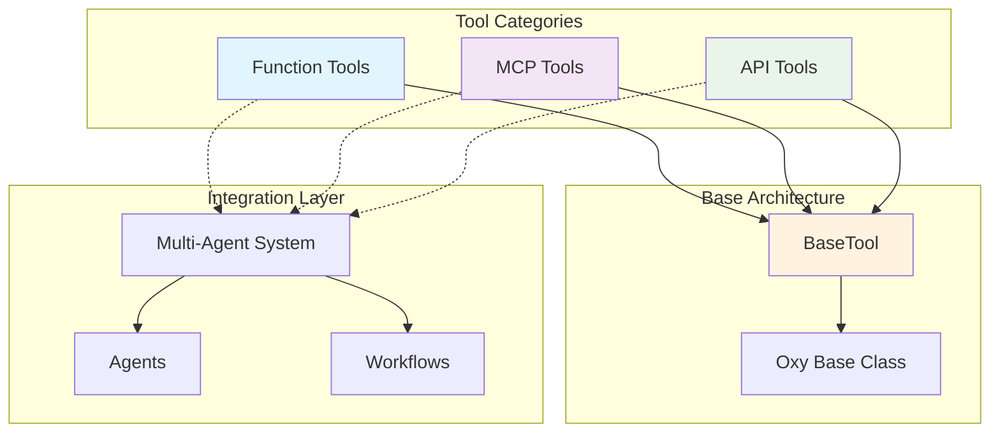

# Tools Overview

OxyGent's tools system provides a unified framework for extending agent capabilities through various types of executable tools. From Python function integration to external API connectivity and Model Context Protocol (MCP) server integration, the tools ecosystem enables agents to perform diverse tasks across different domains and technologies.

## Architecture Overview

The OxyGent tools system is built on a hierarchical architecture that provides consistency while enabling diverse functionality:



## Tool Categories

### [Function Tools](./function-tools)
**Dynamic Python function registration and execution**

Transform regular Python functions into executable tools within the OxyGent system using decorator-based registration.

**Key Components:**
- **[FunctionHub](./function-tools/function-hub)**: Central registry for function management
- **[FunctionTool](./function-tools/function-tool)**: Individual function wrapper with schema extraction

**Use Cases:**
- Custom business logic implementation
- Data processing and transformation
- System integration functions
- Utility operations

```python
from oxygent.oxy.function_tools import FunctionHub

hub = FunctionHub(name="business_logic")

@hub.tool("Calculate order total with tax")
def calculate_total(subtotal: float, tax_rate: float = 0.08) -> dict:
    tax = subtotal * tax_rate
    total = subtotal + tax
    return {"subtotal": subtotal, "tax": tax, "total": total}

await hub.init()  # Registers function as tool
```

### [MCP Tools](./mcp-tools)
**Model Context Protocol server integration**

Connect to external MCP servers for accessing a wide ecosystem of specialized tools and services.

**Key Components:**
- **[BaseMCPClient](./mcp-tools/base-mcp-client)**: Core MCP functionality and lifecycle management
- **[StdioMCPClient](./mcp-tools/stdio-mcp-client)**: Local process communication via stdin/stdout
- **[SSEMCPClient](./mcp-tools/sse-mcp-client)**: Real-time streaming via Server-Sent Events
- **[StreamableMCPClient](./mcp-tools/streamable-mcp-client)**: HTTP-based streaming communication
- **[MCPTool](./mcp-tools/mcp-tool)**: Individual tool proxy for MCP server tools

**Use Cases:**
- File system operations
- Database connectivity
- Web scraping and data extraction
- Development tool integration
- Real-time data streaming

```python
from oxygent.oxy.mcp_tools import StdioMCPClient

# Filesystem MCP server
fs_client = StdioMCPClient(
    name="filesystem",
    params={
        "command": "npx",
        "args": ["-y", "@modelcontextprotocol/server-filesystem", "/workspace"]
    }
)

await fs_client.init()  # Discovers and registers all filesystem tools
```

### [API Tools](./api-tools)
**HTTP-based external service integration**

Make HTTP requests to external APIs and web services with configurable authentication, headers, and parameters.

**Key Components:**
- **[HttpTool](./api-tools/http-tool)**: Flexible HTTP request tool with comprehensive configuration

**Use Cases:**
- REST API integration
- Microservices communication
- Third-party service connectivity
- Data pipeline endpoints

```python
from oxygent.oxy.api_tools import HttpTool

api_tool = HttpTool(
    name="weather_service",
    method="GET",
    url="https://api.weather.com/v1/current",
    headers={"Authorization": f"Bearer {api_key}"},
    default_params={"format": "json", "units": "metric"}
)
```

## Unified Tool Interface

All tools in OxyGent inherit from `BaseTool`, providing a consistent interface regardless of the underlying implementation:

### Core Properties
- **`name`**: Unique tool identifier
- **`desc`**: Human-readable description
- **`category`**: Always "tool" for tool instances
- **`is_permission_required`**: Security control flag (default: True)
- **`timeout`**: Execution timeout in seconds (default: 60)
- **`input_schema`**: Parameter schema for validation

### Execution Model
```python
# Unified execution interface
response = await tool._execute(OxyRequest(
    callee="tool_name",
    arguments={"param1": "value1", "param2": "value2"}
))

# Standard response format
if response.state == OxyState.COMPLETED:
    result = response.output
elif response.state == OxyState.FAILED:
    error = response.output
```

## Integration Patterns

### Agent Integration

```python
from oxygent.agents import ChatAgent

# Create specialized agent with multiple tool types
data_agent = ChatAgent(name="data_specialist")

# Add function tools
data_agent.add_oxy(function_hub)

# Add MCP tools
data_agent.add_oxy(mcp_client)

# Add API tools
data_agent.add_oxy(http_tool)

# Agent now has access to all tool types
response = await data_agent.execute(OxyRequest(
    callee="any_registered_tool",
    arguments={"param": "value"}
))
```

### Workflow Integration

```python
from oxygent.flows import WorkflowFlow

# Multi-tool workflow
workflow = WorkflowFlow(name="data_processing_pipeline")

# Add tools from different categories
workflow.add_oxy(function_hub)     # Custom processing functions
workflow.add_oxy(mcp_client)       # File operations
workflow.add_oxy(api_tool)         # External API calls

# Define multi-stage workflow
workflow_config = {
    "steps": [
        {
            "name": "fetch_data",
            "tool": "api_fetch_data",        # API Tool
            "arguments": {"source": "production"}
        },
        {
            "name": "process_data",
            "tool": "transform_data",        # Function Tool
            "arguments": {"data": "{fetch_data.output}"}
        },
        {
            "name": "save_results",
            "tool": "write_file",           # MCP Tool
            "arguments": {
                "path": "/output/processed.json",
                "content": "{process_data.output}"
            }
        }
    ]
}
```

### Multi-Agent System Orchestration

```python
from oxygent.mas import MAS

# Create MAS with diverse tool ecosystem
mas = MAS()

# Register tools from all categories
tools = [
    function_hub,        # Business logic functions
    fs_mcp_client,       # File operations
    db_mcp_client,       # Database operations
    api_client,          # External APIs
    payment_api_tool,    # Payment processing
    notification_tool    # Notifications
]

for tool in tools:
    tool.set_mas(mas)
    await tool.init()

# Create specialized agents
file_agent = ChatAgent(name="file_specialist")
file_agent.add_oxy(fs_mcp_client)

api_agent = ChatAgent(name="api_specialist") 
api_agent.add_oxy(api_client)
api_agent.add_oxy(payment_api_tool)

business_agent = ChatAgent(name="business_logic")
business_agent.add_oxy(function_hub)

# Agents collaborate using different tool types
```

## Advanced Usage Patterns

### Tool Composition and Chaining

```python
async def complex_business_process(order_data: dict):
    """Complex process using multiple tool types."""
    
    # 1. Validate order using function tool
    validation_response = await business_agent.execute(OxyRequest(
        callee="validate_order",
        arguments={"order": order_data}
    ))
    
    if validation_response.state == OxyState.FAILED:
        return {"error": "Order validation failed"}
    
    # 2. Check inventory using API tool
    inventory_response = await api_agent.execute(OxyRequest(
        callee="check_inventory",
        arguments={"items": order_data["items"]}
    ))
    
    # 3. Save order details using MCP file tool
    save_response = await file_agent.execute(OxyRequest(
        callee="write_file",
        arguments={
            "path": f"/orders/{order_data['id']}.json",
            "content": json.dumps(order_data)
        }
    ))
    
    # 4. Send confirmation using API tool
    notification_response = await api_agent.execute(OxyRequest(
        callee="send_notification",
        arguments={
            "user_id": order_data["user_id"],
            "message": "Order confirmed"
        }
    ))
    
    return {
        "order_id": order_data["id"],
        "status": "completed",
        "confirmations": {
            "validation": validation_response.output,
            "inventory": inventory_response.output,
            "saved": save_response.state == OxyState.COMPLETED,
            "notified": notification_response.state == OxyState.COMPLETED
        }
    }
```

### Dynamic Tool Discovery and Management

```python
class ToolRegistry:
    """Dynamic tool registry for runtime tool management."""
    
    def __init__(self):
        self.tools = {}
        self.categories = {
            "function": [],
            "mcp": [],
            "api": []
        }
    
    async def register_tool_source(self, source):
        """Register tool source (hub, client, or individual tool)."""
        if isinstance(source, FunctionHub):
            await source.init()
            # Function tools are registered through MAS
            self.categories["function"].extend(source.func_dict.keys())
        
        elif isinstance(source, BaseMCPClient):
            await source.init()
            self.categories["mcp"].extend(source.included_tool_name_list)
        
        elif isinstance(source, HttpTool):
            self.tools[source.name] = source
            self.categories["api"].append(source.name)
    
    def get_tools_by_category(self, category: str) -> list:
        """Get tools by category."""
        return self.categories.get(category, [])
    
    def get_all_tools(self) -> dict:
        """Get comprehensive tool inventory."""
        return {
            "total_tools": sum(len(tools) for tools in self.categories.values()),
            "by_category": self.categories,
            "function_tools": len(self.categories["function"]),
            "mcp_tools": len(self.categories["mcp"]),
            "api_tools": len(self.categories["api"])
        }

# Usage
registry = ToolRegistry()
await registry.register_tool_source(function_hub)
await registry.register_tool_source(mcp_client)
await registry.register_tool_source(api_tool)

inventory = registry.get_all_tools()
print(f"Total tools available: {inventory['total_tools']}")
```

### Error Handling and Resilience

```python
async def resilient_tool_execution(tool_name: str, arguments: dict, agents: list):
    """Execute tool with fallback strategies."""
    
    # Try primary tool
    for agent in agents:
        try:
            response = await agent.execute(OxyRequest(
                callee=tool_name,
                arguments=arguments
            ))
            
            if response.state == OxyState.COMPLETED:
                return response
        except Exception as e:
            logger.warning(f"Tool {tool_name} failed on agent {agent.name}: {e}")
            continue
    
    # If all agents fail, try alternative tools
    alternative_tools = {
        "read_file": ["mcp_read_file", "api_fetch_content", "function_load_data"],
        "send_notification": ["api_send_email", "mcp_slack_notify", "function_log_message"]
    }
    
    if tool_name in alternative_tools:
        for alternative in alternative_tools[tool_name]:
            for agent in agents:
                try:
                    response = await agent.execute(OxyRequest(
                        callee=alternative,
                        arguments=arguments
                    ))
                    
                    if response.state == OxyState.COMPLETED:
                        logger.info(f"Successfully used alternative tool: {alternative}")
                        return response
                except Exception as e:
                    logger.warning(f"Alternative tool {alternative} failed: {e}")
                    continue
    
    return OxyResponse(
        state=OxyState.FAILED,
        output="All tool execution attempts failed"
    )
```

## Performance Considerations

### Tool Initialization Optimization

```python
async def optimized_tool_initialization():
    """Optimized parallel tool initialization."""
    
    # Prepare all tool sources
    tool_sources = [
        function_hub,
        fs_mcp_client,
        api_mcp_client,
        http_tools_list
    ]
    
    # Initialize in parallel
    initialization_tasks = []
    for source in tool_sources:
        if hasattr(source, 'init'):
            initialization_tasks.append(source.init())
    
    # Wait for all initializations
    await asyncio.gather(*initialization_tasks, return_exceptions=True)
    
    # Verify initialization success
    for i, source in enumerate(tool_sources):
        if hasattr(source, 'included_tool_name_list'):
            tool_count = len(source.included_tool_name_list)
            print(f"{source.name}: {tool_count} tools initialized")
```

### Memory Management

```python
class ManagedToolEnvironment:
    """Managed environment for tool lifecycle."""
    
    def __init__(self):
        self.active_tools = {}
        self.cleanup_handlers = []
    
    async def add_tool_source(self, source):
        """Add tool source with cleanup tracking."""
        await source.init()
        self.active_tools[source.name] = source
        
        # Register cleanup handler
        if hasattr(source, 'cleanup'):
            self.cleanup_handlers.append(source.cleanup)
    
    async def cleanup_all(self):
        """Clean up all tool resources."""
        cleanup_tasks = [handler() for handler in self.cleanup_handlers]
        await asyncio.gather(*cleanup_tasks, return_exceptions=True)
        
        self.active_tools.clear()
        self.cleanup_handlers.clear()
    
    async def __aenter__(self):
        return self
    
    async def __aexit__(self, exc_type, exc_val, exc_tb):
        await self.cleanup_all()

# Usage
async with ManagedToolEnvironment() as env:
    await env.add_tool_source(function_hub)
    await env.add_tool_source(mcp_client)
    await env.add_tool_source(api_tool)
    
    # Use tools...
    # Automatic cleanup on exit
```

## Security and Best Practices

### Permission Management

```python
class SecurityConfig:
    """Security configuration for tools."""
    
    # Tools that require explicit permission
    HIGH_RISK_TOOLS = {
        "delete_file", "execute_command", "send_email", 
        "modify_database", "payment_process"
    }
    
    # Tools allowed without permission (read-only operations)
    LOW_RISK_TOOLS = {
        "read_file", "list_directory", "get_weather",
        "search_data", "format_text"
    }
    
    @classmethod
    def configure_tool_security(cls, tool):
        """Configure security settings for tool."""
        if tool.name in cls.HIGH_RISK_TOOLS:
            tool.is_permission_required = True
            tool.timeout = min(tool.timeout, 30.0)  # Shorter timeout
        elif tool.name in cls.LOW_RISK_TOOLS:
            tool.is_permission_required = False
        
        return tool

# Apply security configuration
for tool in all_tools:
    SecurityConfig.configure_tool_security(tool)
```

### Input Validation

```python
class ToolValidator:
    """Validation framework for tool inputs."""
    
    @staticmethod
    def validate_file_path(path: str) -> bool:
        """Validate file path for security."""
        # Prevent directory traversal
        if ".." in path or path.startswith("/"):
            return False
        
        # Check allowed extensions
        allowed_extensions = {".txt", ".json", ".csv", ".md"}
        if not any(path.endswith(ext) for ext in allowed_extensions):
            return False
        
        return True
    
    @staticmethod
    def validate_url(url: str) -> bool:
        """Validate URL for security."""
        if not url.startswith(("https://", "http://localhost")):
            return False
        
        # Block internal network addresses
        blocked_patterns = ["127.0.0.1", "localhost", "10.", "192.168.", "172."]
        return not any(pattern in url for pattern in blocked_patterns)
    
    @classmethod
    def validate_tool_arguments(cls, tool_name: str, arguments: dict) -> tuple[bool, str]:
        """Validate tool arguments based on tool type."""
        
        validation_rules = {
            "read_file": lambda args: cls.validate_file_path(args.get("path", "")),
            "write_file": lambda args: cls.validate_file_path(args.get("path", "")),
            "api_call": lambda args: cls.validate_url(args.get("url", "")),
        }
        
        if tool_name in validation_rules:
            is_valid = validation_rules[tool_name](arguments)
            if not is_valid:
                return False, f"Invalid arguments for {tool_name}"
        
        return True, "Valid"

# Usage in execution
async def secure_tool_execution(tool_name: str, arguments: dict):
    """Execute tool with security validation."""
    
    # Validate arguments
    is_valid, error_msg = ToolValidator.validate_tool_arguments(tool_name, arguments)
    if not is_valid:
        return OxyResponse(state=OxyState.FAILED, output=error_msg)
    
    # Execute tool
    return await agent.execute(OxyRequest(callee=tool_name, arguments=arguments))
```

## Monitoring and Observability

### Tool Execution Metrics

```python
class ToolMetrics:
    """Metrics collection for tool execution."""
    
    def __init__(self):
        self.execution_counts = {}
        self.execution_times = {}
        self.error_counts = {}
    
    def record_execution(self, tool_name: str, execution_time: float, success: bool):
        """Record tool execution metrics."""
        # Count executions
        self.execution_counts[tool_name] = self.execution_counts.get(tool_name, 0) + 1
        
        # Track execution times
        if tool_name not in self.execution_times:
            self.execution_times[tool_name] = []
        self.execution_times[tool_name].append(execution_time)
        
        # Count errors
        if not success:
            self.error_counts[tool_name] = self.error_counts.get(tool_name, 0) + 1
    
    def get_tool_stats(self, tool_name: str) -> dict:
        """Get statistics for specific tool."""
        executions = self.execution_counts.get(tool_name, 0)
        times = self.execution_times.get(tool_name, [])
        errors = self.error_counts.get(tool_name, 0)
        
        return {
            "total_executions": executions,
            "error_count": errors,
            "error_rate": errors / max(executions, 1),
            "avg_execution_time": sum(times) / len(times) if times else 0,
            "max_execution_time": max(times) if times else 0,
            "min_execution_time": min(times) if times else 0
        }
    
    def get_system_stats(self) -> dict:
        """Get system-wide tool statistics."""
        total_executions = sum(self.execution_counts.values())
        total_errors = sum(self.error_counts.values())
        
        return {
            "total_tools": len(self.execution_counts),
            "total_executions": total_executions,
            "total_errors": total_errors,
            "system_error_rate": total_errors / max(total_executions, 1),
            "most_used_tools": sorted(
                self.execution_counts.items(), 
                key=lambda x: x[1], 
                reverse=True
            )[:10]
        }

# Global metrics instance
tool_metrics = ToolMetrics()

# Instrumented tool execution
async def instrumented_tool_execution(tool_name: str, arguments: dict):
    """Tool execution with metrics collection."""
    start_time = time.time()
    
    try:
        response = await agent.execute(OxyRequest(callee=tool_name, arguments=arguments))
        execution_time = time.time() - start_time
        success = response.state == OxyState.COMPLETED
        
        tool_metrics.record_execution(tool_name, execution_time, success)
        return response
        
    except Exception as e:
        execution_time = time.time() - start_time
        tool_metrics.record_execution(tool_name, execution_time, False)
        raise
```

## Migration and Upgrade Strategies

### Legacy Tool Integration

```python
class LegacyToolAdapter:
    """Adapter for legacy tools to new OxyGent interface."""
    
    def __init__(self, legacy_function, name: str, description: str):
        self.legacy_function = legacy_function
        self.name = name
        self.description = description
    
    def to_function_tool(self) -> FunctionTool:
        """Convert legacy function to FunctionTool."""
        
        # Wrap legacy function to match expected signature
        async def wrapped_function(**kwargs):
            # Convert kwargs to legacy function format
            result = self.legacy_function(kwargs)
            return result
        
        return FunctionTool(
            name=self.name,
            desc=self.description,
            func_process=wrapped_function
        )

# Usage
legacy_tools = [
    LegacyToolAdapter(old_calculate_tax, "calculate_tax", "Calculate tax amount"),
    LegacyToolAdapter(old_send_email, "send_email", "Send email notification")
]

# Convert to new format
for adapter in legacy_tools:
    new_tool = adapter.to_function_tool()
    agent.add_oxy(new_tool)
```

### Tool Version Management

```python
class ToolVersionManager:
    """Manage tool versions and compatibility."""
    
    def __init__(self):
        self.tool_versions = {}
        self.compatibility_matrix = {}
    
    def register_tool_version(self, tool_name: str, version: str, tool_instance):
        """Register tool version."""
        if tool_name not in self.tool_versions:
            self.tool_versions[tool_name] = {}
        
        self.tool_versions[tool_name][version] = tool_instance
    
    def get_compatible_tool(self, tool_name: str, required_version: str):
        """Get tool compatible with required version."""
        if tool_name in self.tool_versions:
            # Return exact version if available
            if required_version in self.tool_versions[tool_name]:
                return self.tool_versions[tool_name][required_version]
            
            # Return latest version as fallback
            versions = sorted(self.tool_versions[tool_name].keys())
            return self.tool_versions[tool_name][versions[-1]]
        
        return None
    
    def deprecate_tool_version(self, tool_name: str, version: str, replacement_version: str):
        """Mark tool version as deprecated."""
        print(f"Tool {tool_name} v{version} is deprecated. Use v{replacement_version} instead.")

# Usage
version_manager = ToolVersionManager()
version_manager.register_tool_version("data_processor", "1.0", old_processor_tool)
version_manager.register_tool_version("data_processor", "2.0", new_processor_tool)
```

## Future Roadmap

The OxyGent tools system continues to evolve with planned enhancements:

### Upcoming Features

1. **GraphQL Tools**: Native GraphQL query and mutation support
2. **WebSocket Tools**: Real-time bidirectional communication
3. **gRPC Integration**: Protocol buffer-based service communication
4. **Database Tools**: Direct database connectivity with ORM support
5. **AI Model Tools**: Integration with machine learning models and APIs

### Enhanced Capabilities

1. **Tool Composition**: Combine multiple tools into complex operations
2. **Circuit Breakers**: Advanced fault tolerance patterns
3. **Rate Limiting**: Built-in request rate management
4. **Caching Layer**: Intelligent response caching across tool types
5. **Monitoring Dashboard**: Visual tool performance monitoring

### Integration Improvements

1. **Kubernetes Integration**: Native K8s service discovery
2. **Service Mesh**: Istio and Linkerd integration
3. **Observability**: OpenTelemetry tracing and metrics
4. **Configuration Management**: Centralized tool configuration
5. **Security Enhancements**: Advanced authentication and authorization

## Getting Started

Choose your tool integration approach based on your needs:

### Quick Start Options

1. **[Function Tools](./function-tools)** - Start here for custom Python functions
2. **[MCP Tools](./mcp-tools)** - Integrate external MCP servers for specialized functionality
3. **[API Tools](./api-tools)** - Connect to REST APIs and web services

### Next Steps

1. **Explore Examples**: Review integration examples in each tool category
2. **Plan Architecture**: Design your tool composition strategy
3. **Implement Security**: Configure appropriate permission and validation settings
4. **Monitor Performance**: Set up metrics and observability
5. **Scale Gradually**: Start with core tools and expand based on requirements

The OxyGent tools ecosystem provides the foundation for building sophisticated AI agents capable of interacting with diverse systems, processing complex data, and executing multi-step workflows across various domains and technologies.