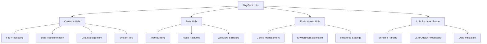

# Utility System Overview

The OxyGent utility system provides a comprehensive collection of helper modules that support core framework functionality. These utilities handle essential operations like file processing, environment management, data transformation, and structured parsing to ensure robust and efficient system operation.

## Architecture Overview

The utility system is organized into specialized modules, each addressing specific operational needs:



## Core Modules

### [Common Utils](/utils/common-utils)
**File Processing, Data Transformation, and System Operations**

The `common_utils` module serves as the foundation for general-purpose operations throughout the OxyGent framework. It provides essential functionality for:

- **Multi-format File Processing**: Convert images, videos, tables, and documents to base64 encoding with automatic optimization
- **Data Transformation**: JSON extraction, list chunking, and serialization utilities
- **URL Manipulation**: Build and modify URLs with query parameter support
- **System Information**: Platform detection, MAC address retrieval, and timestamp generation
- **Attachment Processing**: Categorize and process file attachments for multimodal AI interactions

**Key Features:**
- Async file operations for non-blocking I/O
- Automatic image resizing and optimization
- Support for 10+ file formats including Excel, CSV, PDF, and media files
- Robust error handling and validation

**Common Use Cases:**
```python
from oxygent.utils.common_utils import image_to_base64, build_url, process_attachments

# Process image for AI model
base64_image = await image_to_base64("/path/to/image.jpg", max_image_pixels=5000000)

# Build API endpoint URL
api_url = build_url("https://api.example.com", "v1/users", {"page": 1, "limit": 10})

# Process mixed file attachments
attachments = process_attachments(["/path/image.jpg", "/path/data.xlsx"])
```

### [Data Utils](/utils/data-utils)
**Tree Building and Hierarchical Data Processing**

The `data_utils` module specializes in handling complex data structures, particularly for workflow orchestration and node relationship management:

- **Node Relationship Management**: Add bidirectional parent-child and dependency relationships
- **Tree Construction**: Build hierarchical structures from flat node lists
- **Parallel Processing Support**: Handle parallel execution groups in workflow trees
- **Workflow Orchestration**: Support for complex multi-step process planning

**Key Features:**
- In-place node enhancement for memory efficiency
- Support for parallel execution groups
- Flexible tree building with custom ordering
- Workflow dependency resolution

**Common Use Cases:**
```python
from oxygent.utils.data_utils import add_post_and_child_node_ids, build_tree

# Enhance node relationships
workflow_nodes = [...]  # List of workflow nodes
add_post_and_child_node_ids(workflow_nodes)

# Build execution tree
execution_tree = build_tree(workflow_nodes)
```

### [Environment Utils](/utils/env-utils)
**Environment Variables and System Configuration**

The `env_utils` module provides comprehensive environment variable management with type safety and deployment-specific configuration:

- **Type-Safe Environment Access**: Retrieve environment variables with automatic type conversion
- **Deployment Stage Detection**: Identify production, development, or local environments
- **Resource Configuration**: CPU core detection and system resource management
- **Network Information**: Local IP detection and network configuration

**Key Features:**
- Type validation for environment variables
- Comma-separated list parsing
- Production environment detection
- Graceful error handling with defaults

**Common Use Cases:**
```python
from oxygent.utils.env_utils import get_env_var, is_prod_env, get_local_ip

# Type-safe environment variable access
database_url = get_env_var("DATABASE_URL", str, "sqlite:///default.db")
allowed_hosts = get_env_var("ALLOWED_HOSTS", list, ["localhost"])

# Environment-specific configuration
if is_prod_env():
    log_level = "WARNING"
else:
    log_level = "DEBUG"
```

### [LLM Pydantic Parser](/utils/llm-pydantic-parser)
**Structured Output Processing for Large Language Models**

The `llm_pydantic_parser` module enables reliable extraction of structured data from LLM responses using Pydantic models:

- **Schema-Driven Parsing**: Convert LLM text outputs to typed Python objects
- **Automatic Validation**: Leverage Pydantic's validation for data integrity
- **Flexible Templates**: Customizable prompt formatting for different LLM providers
- **Error Recovery**: Robust parsing with comprehensive error handling

**Key Features:**
- JSON schema generation for LLM prompts
- Automatic data validation and type conversion
- Custom formatting templates
- Comprehensive error handling and recovery

**Common Use Cases:**
```python
from oxygent.utils.llm_pydantic_parser import PydanticOutputParser
from pydantic import BaseModel

class UserProfile(BaseModel):
    name: str
    age: int
    email: str

# Create parser and process LLM output
parser = PydanticOutputParser(output_cls=UserProfile)
enhanced_prompt = parser.format("Extract user information from this text")
user_profile = parser.parse(llm_response_text)
```

## Integration Patterns

### Cross-Module Workflows

The utility modules are designed to work together seamlessly for complex operations:

#### File Processing Pipeline
```python
from oxygent.utils.common_utils import process_attachments, image_to_base64
from oxygent.utils.env_utils import get_env_var

async def process_user_uploads(file_paths):
    # Environment-based configuration
    max_image_size = int(get_env_var("MAX_IMAGE_PIXELS", str, "10000000"))
    
    # Process attachments
    categorized_files = process_attachments(file_paths)
    
    # Convert images to base64
    processed_files = []
    for file_info in categorized_files:
        if file_info["type"] == "image_url":
            base64_data = await image_to_base64(
                file_info["image_url"]["url"],
                max_image_pixels=max_image_size
            )
            processed_files.append({"type": "image", "data": base64_data})
    
    return processed_files
```

#### Structured Data Extraction Workflow
```python
from oxygent.utils.llm_pydantic_parser import PydanticOutputParser
from oxygent.utils.data_utils import build_tree
from pydantic import BaseModel
from typing import List

class WorkflowNode(BaseModel):
    node_id: str
    node_name: str
    node_type: str
    from_node_id: str = None
    order: int

class WorkflowPlan(BaseModel):
    name: str
    nodes: List[WorkflowNode]

async def extract_and_build_workflow(llm_response: str):
    # Parse structured workflow from LLM
    parser = PydanticOutputParser(output_cls=WorkflowPlan)
    workflow_plan = parser.parse(llm_response)
    
    # Build execution tree
    execution_tree = build_tree([node.dict() for node in workflow_plan.nodes])
    
    return {
        "plan": workflow_plan,
        "execution_tree": execution_tree
    }
```

### Configuration Management Pattern

```python
from oxygent.utils.env_utils import get_env_var, is_prod_env
from oxygent.utils.common_utils import get_local_ip

class SystemConfig:
    """Centralized system configuration using utility modules."""
    
    def __init__(self):
        # Environment-based settings
        self.environment = "production" if is_prod_env() else "development"
        self.debug = not is_prod_env()
        
        # Network configuration
        self.host = get_local_ip()
        self.port = int(get_env_var("PORT", str, "8000"))
        
        # Processing limits
        self.max_image_pixels = int(get_env_var("MAX_IMAGE_PIXELS", str, "10000000"))
        self.max_file_size = int(get_env_var("MAX_FILE_SIZE", str, "10485760"))
        
        # Database configuration
        self.database_url = get_env_var("DATABASE_URL", str)
        
        # API keys and secrets
        if is_prod_env():
            self.api_keys = get_env_var("API_KEYS", list)
        else:
            self.api_keys = ["development_key"]

config = SystemConfig()
```

## Performance Optimization

The utility system is designed for optimal performance across different deployment scenarios:

### Async Operations
- All file I/O operations use `async`/`await` for non-blocking execution
- Concurrent processing of multiple files and data structures
- Streaming support for large file operations

### Memory Management
- In-place data structure modifications where possible
- Automatic image resizing to prevent memory overflow
- Efficient tree building algorithms with minimal memory footprint

### Caching and Optimization
- Built-in optimizations for repeated operations
- Lazy evaluation for expensive computations
- Configurable limits based on system resources

## Error Handling Philosophy

The utility system implements comprehensive error handling strategies:

### Graceful Degradation
- Fallback to default values when environment variables are missing
- Continue operation with warnings when non-critical operations fail
- Preserve original data when transformation fails

### Validation and Type Safety
- Type checking at runtime for critical operations
- Pydantic model validation for structured data
- Input sanitization and validation

### Logging and Monitoring
- Detailed error messages with context information
- Warning logs for configuration issues
- Performance metrics for optimization

## Best Practices

### Module Usage Guidelines

1. **Import Specificity**: Import only needed functions to minimize memory usage
2. **Error Handling**: Always wrap utility calls in appropriate try-catch blocks
3. **Configuration**: Use environment-based configuration for deployment flexibility
4. **Type Safety**: Leverage type hints and Pydantic models for data integrity
5. **Async Patterns**: Use async utilities for I/O operations in async contexts

### Performance Considerations

1. **File Size Limits**: Configure appropriate limits based on system resources
2. **Concurrent Operations**: Use asyncio for concurrent file processing
3. **Memory Monitoring**: Monitor memory usage when processing large datasets
4. **Environment Optimization**: Configure different limits for production vs development

### Security Best Practices

1. **Input Validation**: Validate all external inputs and file paths
2. **Environment Variables**: Never log sensitive environment variable values
3. **File Access**: Implement proper file access controls and validation
4. **Data Sanitization**: Sanitize data before processing or storage

## Extension Points

The utility system is designed for extensibility:

### Custom Parsers
- Extend `PydanticOutputParser` for specialized parsing needs
- Create custom formatting templates for specific LLM providers
- Add validation rules for domain-specific data structures

### File Processing Extensions
- Add support for additional file formats
- Implement custom optimization algorithms
- Create specialized processing pipelines

### Environment Management
- Add custom environment variable processing functions
- Implement environment-specific configuration validators
- Create deployment-specific utility functions

## Migration and Compatibility

When upgrading or migrating utility functions:

1. **Backward Compatibility**: Maintain backward compatibility for public APIs
2. **Deprecation Warnings**: Provide clear deprecation warnings for outdated functions
3. **Migration Guides**: Document migration paths for breaking changes
4. **Version Testing**: Test utility functions across different Python and dependency versions

The OxyGent utility system forms the backbone of reliable, efficient operations throughout the framework, providing essential functionality that enables higher-level components to focus on their core responsibilities while ensuring consistent, robust system behavior.